# rtrace Ray Tracer Documentation

This comprehensive guide covers all features and options available in the rtrace ray tracer, including scene format reference, command-line usage, and visual examples.

## Table of Contents

1. [Command Line Interface](#command-line-interface)
   - [Movie Generation](#movie-generation)
2. [Scene Format Overview](#scene-format-overview)

### Scene Configuration
3. [Camera](#camera)
   - [Orthographic Camera](#orthographic-camera)
   - [Perspective Camera](#perspective-camera)
   - [Grid Background](#grid-background)
4. [Objects](#objects)
   - [Sphere](#sphere)
   - [Plane](#plane)
   - [Cube](#cube)
   - [Mesh (STL)](#mesh-stl)
   - [Object Transforms](#object-transforms)
5. [Materials](#materials)
   - [Basic Properties](#basic-properties)
   - [Reflectivity](#reflectivity)
   - [Textures](#textures)
6. [Lighting](#lighting)
   - [Point Lights](#point-lights)
   - [Area Lights](#area-lights)

### Rendering Configuration
7. [Scene Settings](#scene-settings)
   - [Ambient Illumination](#ambient-illumination)
   - [Background Color](#background-color)
   - [Fog Effects](#fog-effects)
8. [Anti-Aliasing](#anti-aliasing)
   - [Quincunx](#quincunx)
   - [Stochastic](#stochastic)
   - [No Jitter](#no-jitter)
9. [Screen-Space Outline Detection](#screen-space-outline-detection)
   - [Configuration](#configuration-1)
   - [Basic Usage](#basic-usage-1)
   - [Parameter Tuning Tips](#parameter-tuning-tips)

### Advanced Topics
10. [Deterministic Rendering](#deterministic-rendering)
11. [Examples](#examples)

---

## Command Line Interface

The rtrace CLI tool renders scenes from JSON files to PNG images or WebM movies.

### Usage

```bash
./target/release/rtrace-cli [OPTIONS] --input <INPUT> --output <OUTPUT>
```

### Options

| Option | Short | Description | Default |
|--------|-------|-------------|---------|
| `--input <INPUT>` | `-i` | Input JSON scene file (required) | - |
| `--output <OUTPUT>` | `-o` | Output file (PNG for images, WebM for movies) | - |
| `--size <SIZE>` | `-s` | Image diagonal size in pixels (aspect ratio computed from camera settings) | 1000 |
| `--max-depth <MAX_DEPTH>` | - | Maximum ray bounces for reflections | 10 |
| `--samples <SAMPLES>` | - | Number of samples per pixel (fixed modes) | 1 |
| `--anti-aliasing <MODE>` | - | Anti-aliasing mode: `quincunx`, `stochastic`, `dynamic`, or `none` | none |
| `--min-samples <N>` | - | Minimum samples per pixel for dynamic mode | 4 |
| `--max-samples <N>` | - | Maximum samples per pixel for dynamic mode | 256 |
| `--tolerance <F>` | - | Target standard-error tolerance for dynamic mode (fraction of [0,1]) | 0.005 |
| `--rasterize` | - | Use rasterization instead of raytracing for fast preview | - |
| `--movie` | - | Generate a 360° rotation movie (uses rasterization, outputs .webm) | - |
| `--help` | `-h` | Print help information | - |
| `--version` | `-V` | Print version information | - |

### Example Commands

```bash
# Basic rendering
./target/release/rtrace-cli -i examples/simple_sphere.json -o output.png

# Custom resolution (diagonal size)
./target/release/rtrace-cli -i scene.json -o high_res.png -s 2000

# High reflection depth for mirror effects
./target/release/rtrace-cli -i mirror_scene.json -o mirrors.png --max-depth 20

# Fast preview using rasterization
./target/release/rtrace-cli -i scene.json -o preview.png --rasterize

# Stochastic anti-aliasing with 4 samples
./target/release/rtrace-cli -i scene.json -o stochastic.png --anti-aliasing stochastic --samples 4

# High-quality quincunx anti-aliasing
./target/release/rtrace-cli -i scene.json -o smooth.png --anti-aliasing quincunx

# Dynamic adaptive sampling (auto-adjusts per pixel until quality target is met)
./target/release/rtrace-cli -i scene.json -o adaptive.png --anti-aliasing dynamic

# Dynamic with custom quality target (tighter tolerance = more samples)
./target/release/rtrace-cli -i scene.json -o adaptive_hq.png --anti-aliasing dynamic --tolerance 0.001 --max-samples 512

# Generate a 360° rotation movie
./target/release/rtrace-cli -i scene.json -o rotation.webm --movie -s 500
```

### Movie Generation

The `--movie` flag generates a smooth 360-degree rotation animation of your scene:

- **Rotation**: The scene objects rotate about the Z axis in 1-degree increments
- **Camera & Lights**: Camera position and light sources remain static
- **Rendering**: Uses rasterization for fast frame generation
- **Output**: Creates a WebM video file at 30 fps (12 seconds for a full rotation)

**Example:** Rotating cat mesh


```bash
# Generate the demo movie
./target/release/rtrace-cli -i doc/scenes/movie-demo.json -o cat_rotation.webm --movie -s 400
```

---

## Scene Format Overview

Scenes are defined in JSON format. Every scene requires four main sections:

```jsonc
{
  "camera": { /* Camera configuration */ },
  "objects": [ /* Array of objects in the scene */ ],
  "lights": [ /* Array of light sources */ ],
  "scene_settings": { /* Global scene settings */ }
}
```

---

## Camera

The camera determines the view and perspective of your scene. rtrace supports orthographic and perspective cameras, each with different properties and use cases.

### Orthographic Camera

Orthographic cameras provide parallel projection with no perspective distortion - useful for technical drawings and architectural views.

```jsonc
{
  "camera": {
    "kind": "ortho",
    "position": [0, 0, 10],
    "target": [0, 0, 0], 
    "up": [0, 1, 0],
    "width": 6,
    "height": 6
  }
}
```

| Property | Type | Description |
|----------|------|-------------|
| `kind` | string | Camera type, must be `"ortho"` |
| `position` | [x, y, z] | Camera position in 3D space |
| `target` | [x, y, z] | Point the camera looks at |
| `up` | [x, y, z] | Camera up vector (typically [0, 0, 1] for Z-up) |
| `width` | number | Viewport width in world units |
| `height` | number | Viewport height in world units |
| `grid_pitch` | number (optional) | Distance between grid lines for background grid |
| `grid_color` | string (optional) | Hex color for grid lines (e.g., "#444444") |
| `grid_thickness` | number (optional) | Thickness of grid lines in world units |

### Grid Background

Orthographic cameras can display coordinate grid lines in the background when rays miss all objects. This feature helps with spatial reference and technical drawings.

```jsonc
{
  "camera": {
    "kind": "ortho",
    "position": [3, 3, 8],
    "target": [0, 0, 0],
    "up": [0, 1, 0], 
    "width": 8,
    "height": 6,
    "grid_pitch": 1.0,      // Distance between grid lines
    "grid_color": "#444444", // Grid line color
    "grid_thickness": 0.05   // Line thickness in world units
  }
}
```

**Grid Properties:**
- `grid_pitch`: Distance between grid lines (e.g., 1.0 creates lines at x=0, x=1, x=2, etc.)
- `grid_color`: Color of the grid lines in hex format
- `grid_thickness`: Width of the grid lines in world units

All three grid properties must be specified for the grid to appear. Grid backgrounds only work with orthographic cameras and appear on the world coordinate planes (XY, XZ, and YZ) centered at the origin.

**Example:** Technical drawing with coordinate grid

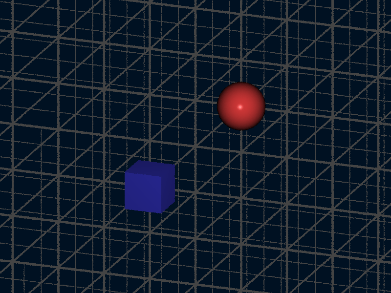

### Perspective Camera

Perspective cameras provide realistic 3D viewing with depth perspective, similar to how human eyes see the world.

```jsonc
{
  "camera": {
    "kind": "perspective",
    "position": [0, 2, 5],
    "target": [0, 0, 0],
    "up": [0, 1, 0],
    "width": 8,
    "height": 6,
    "fov": 60
  }
}
```

| Property | Type | Description |
|----------|------|-------------|
| `kind` | string | Camera type, must be `"perspective"` |
| `position` | [x, y, z] | Camera position in 3D space |
| `target` | [x, y, z] | Point the camera looks at |
| `up` | [x, y, z] | Camera up vector (typically [0, 0, 1] for Z-up) |
| `width` | number | Viewport width in world units |
| `height` | number | Viewport height in world units |
| `fov` | number | Field of view angle in degrees |

---

## Objects

Objects define the 3D geometry in your scene. rtrace supports four types of objects: spheres, planes, cubes, and triangle meshes from STL files.

### Sphere

Spheres are perfect for creating balls, planets, or any round object.

```jsonc
{
  "kind": "sphere",
  "center": [0, 0, 0],
  "radius": 1.5,
  "material": { /* material properties */ }
}
```

**Example:** Simple red sphere

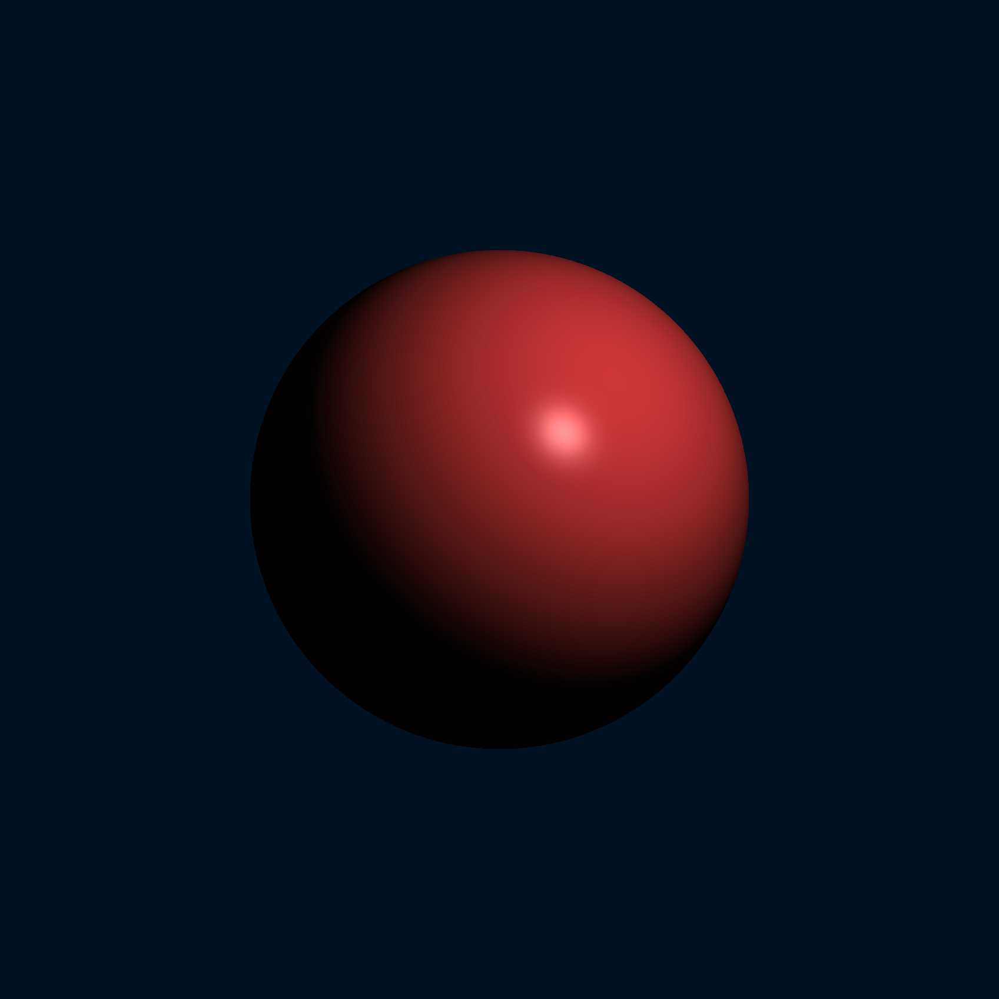

### Plane

Infinite flat surfaces, perfect for ground, walls, or any flat surface in your scene.

```jsonc
{
  "kind": "plane",
  "point": [0, -2, 0],
  "normal": [0, 1, 0],
  "material": { /* material properties */ }
}
```

**Example:** Textured ground plane

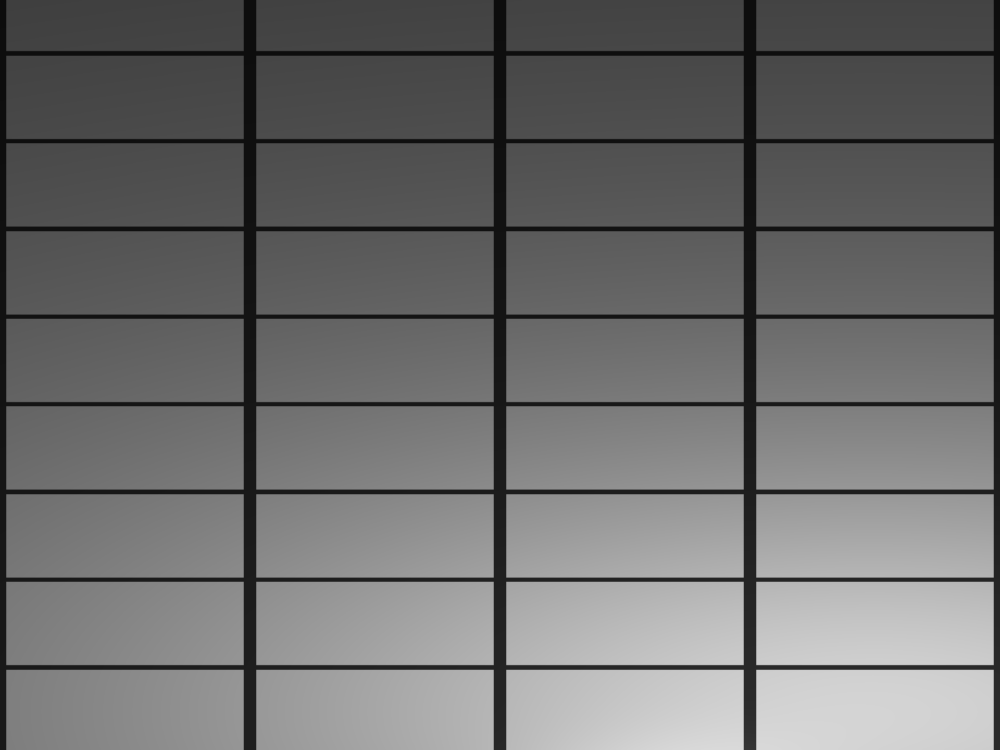

### Cube

Rectangular boxes aligned with coordinate axes, ideal for buildings, containers, or geometric shapes.

```jsonc
{
  "kind": "cube",
  "center": [0, 0, 0],
  "size": [2, 2, 2],
  "material": { /* material properties */ }
}
```

**Example:** Blue cube

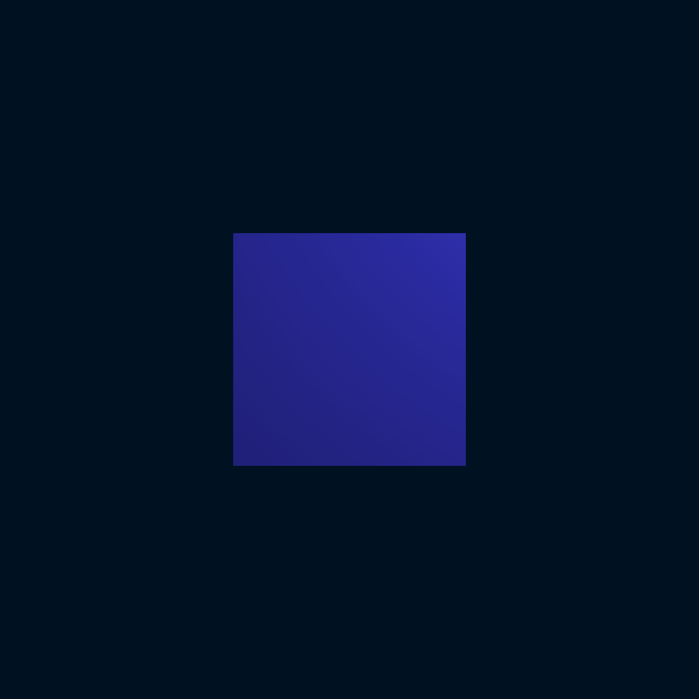

### Mesh (STL)

Complex 3D models from STL files (ASCII or binary format), perfect for importing detailed geometry.

```jsonc
{
  "kind": "mesh",
  "filename": "models/example.stl",
  "material": { /* material properties */ }
}
```

**Example:** STL mesh model

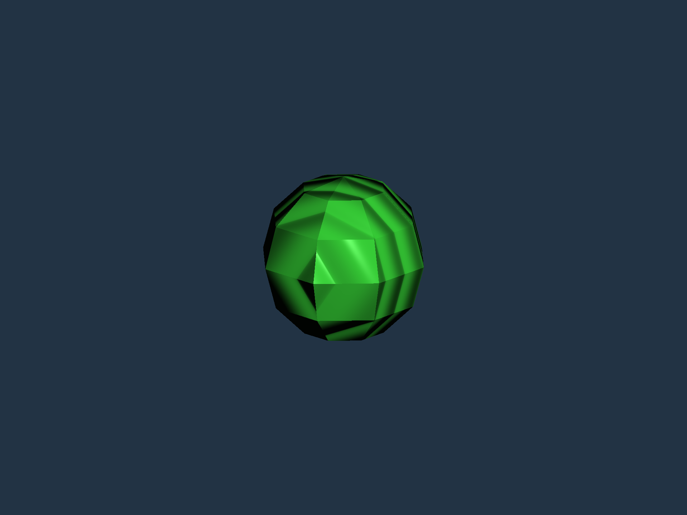

### Object Transforms

All objects (spheres, planes, cubes, and meshes) support optional transform operations for flexible positioning, rotation, and scaling. Transforms allow you to precisely place and orient objects in your scene without modifying the base geometry.

#### Transform Operations

rtrace supports three types of transforms that can be combined in any order:

**Rotation** - `"rotate(x, y, z)"`
- Rotates object around the X, Y, and Z axes
- Values are in degrees (e.g., 90, 180, 270)
- Rotation order: Z-axis → Y-axis → X-axis

**Translation** - `"translate(x, y, z)"`  
- Moves object along the X, Y, and Z axes
- Values are in world coordinate units
- Positive values move in positive axis directions

**Scaling** - `"scale(x, y, z)"`
- Scales object size along the X, Y, and Z axes
- Values are scale factors (1.0 = original size, 2.0 = double, 0.5 = half)
- Different values per axis allow stretching/squashing

#### Transform Syntax

Transforms are defined as an optional array of strings in any object:

```jsonc
{
  "kind": "sphere",
  "center": [0, 0, 0],
  "radius": 1.0,
  "material": { /* ... */ },
  "transform": [
    "rotate(0, 0, 45)",      // Rotate 45° around Z-axis
    "translate(3, 1, 0)",    // Move 3 units right, 1 unit up
    "scale(2, 1, 1)"         // Double width, keep height/depth
  ]
}
```

#### Transform Order

Transforms are applied in the order they appear in the array. This order matters for the final result:

```jsonc
// Option 1: Scale, then translate
"transform": [
  "scale(2, 2, 2)",
  "translate(5, 0, 0)"
]

// Option 2: Translate, then scale  
"transform": [
  "translate(5, 0, 0)",
  "scale(2, 2, 2)"
]
```

In Option 1, the object is doubled in size, then moved 5 units along X-axis.
In Option 2, the object is moved 5 units, then doubled (so it ends up 10 units along X-axis).

#### Practical Examples

**Rotating a cube 45 degrees:**
```jsonc
{
  "kind": "cube",
  "center": [0, 0, 0],
  "size": [2, 2, 2],
  "material": { "color": "#4444FF", /* ... */ },
  "transform": ["rotate(0, 0, 45)"]
}
```

**Creating a scaled and positioned mesh:**
```jsonc
{
  "kind": "mesh",
  "filename": "model.stl",
  "material": { "color": "#FF8080", /* ... */ },
  "transform": [
    "scale(8, 8, 8)",        // Make 8x larger
    "rotate(0, 0, 180)",     // Flip upside down
    "translate(15, 0, 0)"    // Move to the right
  ]
}
```

**Multiple objects with different transforms:**
```jsonc
{
  "objects": [
    {
      "kind": "sphere",
      "center": [0, 0, 0],
      "radius": 1,
      "material": { "color": "#FF4444", /* ... */ },
      "transform": ["translate(-3, 0, 0)"]
    },
    {
      "kind": "sphere", 
      "center": [0, 0, 0],
      "radius": 1,
      "material": { "color": "#4444FF", /* ... */ },
      "transform": [
        "scale(1.5, 1.5, 1.5)",
        "translate(3, 0, 0)"
      ]
    }
  ]
}
```

**Example:** Transform demonstration with two mesh objects

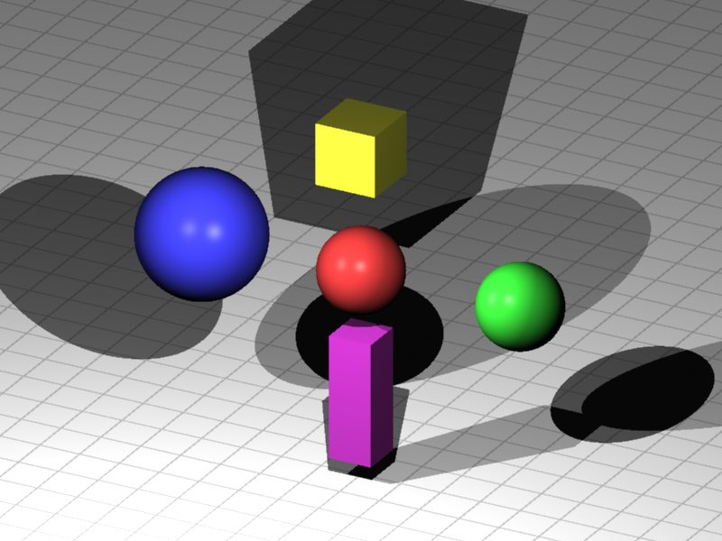

#### Transform Notes

**Performance:** Transforms are applied during scene setup, not during rendering, so they don't affect render performance.

**Coordinate System:** rtrace uses a right-handed Z-up coordinate system optimized for 3D printing workflows:
- +X points right
- +Y points forward (away from viewer)
- +Z points up

**Mesh Transforms:** For STL meshes, transforms are applied to all vertices, and spatial acceleration structures (like K-d trees) are rebuilt automatically.

**Precision:** All transform calculations use 64-bit floating-point math for high precision.

---

## Materials

Materials define how objects appear and interact with light in your scene.

### Basic Properties

Every material needs basic color and lighting properties:

```jsonc
{
  "material": {
    "color": "#FF4444",      // Base color as hex string
    "ambient": 0.1,          // How much ambient light to reflect (0.0-1.0)
    "diffuse": 0.8,          // How much direct light to scatter (0.0-1.0)
    "specular": 0.4,         // How much light to reflect as highlights (0.0-1.0)
    "shininess": 32          // Size of highlights (higher = smaller, sharper)
  }
}
```

**Example:** Material property comparison

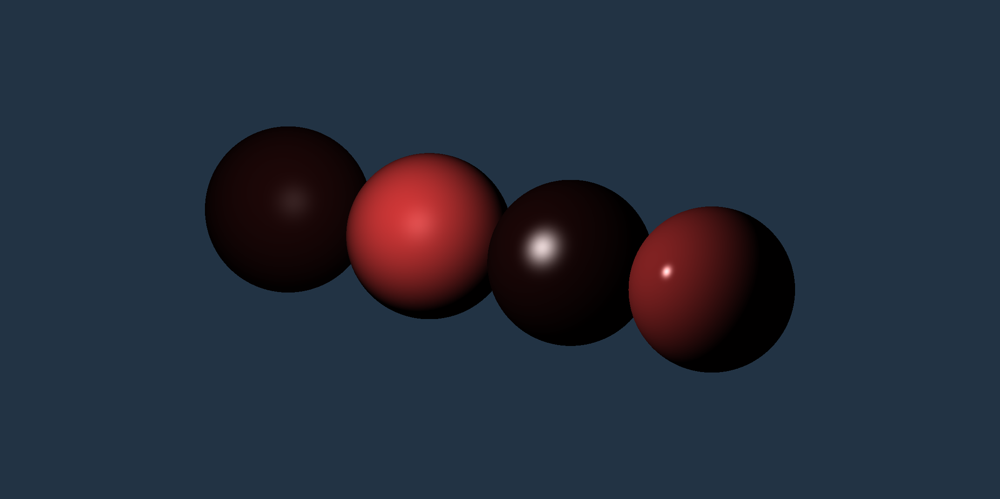

### Reflectivity

Add mirror-like reflections to create realistic shiny surfaces:

```jsonc
{
  "material": {
    "color": "#CCCCCC",
    "ambient": 0.1,
    "diffuse": 0.3,
    "specular": 0.8,
    "shininess": 100,
    "reflectivity": 0.7      // Reflection strength (0.0=no reflection, 1.0=perfect mirror)
  }
}
```

**Example:** Reflective spheres

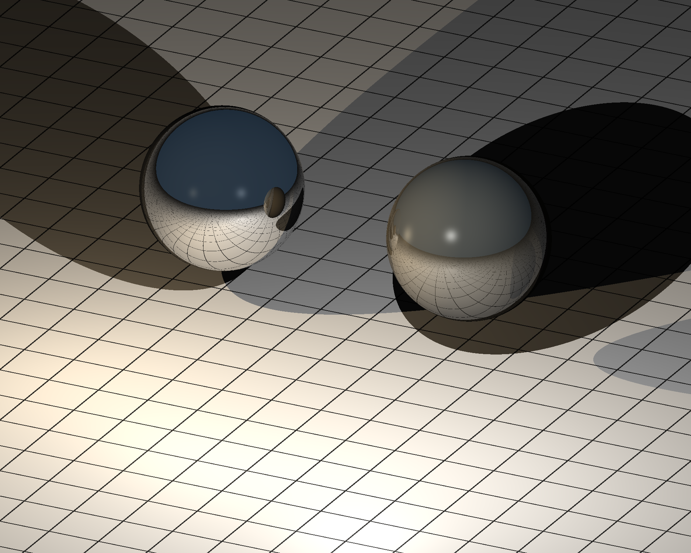

### Textures

Add patterns to surfaces. rtrace supports grid patterns and checkerboard patterns for planes:

#### Grid Texture

Creates grid lines on a surface:

```jsonc
{
  "material": {
    "color": "#FFFFFF",
    "ambient": 0.2,
    "diffuse": 0.8,
    "specular": 0.1,
    "shininess": 10,
    "texture": {
      "type": "grid",           // Pattern type
      "line_color": "#333333",  // Grid line color
      "line_width": 0.1,        // Grid line thickness in world units
      "cell_size": 1.0          // Size of each grid cell
    }
  }
}
```

#### Checkerboard Texture

Creates alternating squares with independent material properties. Each square is exactly 1x1 world units, and you can use object transforms to scale as needed:

```jsonc
{
  "material": {
    "color": "#FFFFFF",        // Base color (not used with checkerboard)
    "ambient": 0.2,
    "diffuse": 0.8,
    "specular": 0.1,
    "shininess": 10,
    "texture": {
      "type": "checkerboard",
      "material_a": {           // First checkerboard material
        "color": "#FF6B6B",     // Independent color
        "ambient": 0.15,        // Independent lighting properties
        "diffuse": 0.9,
        "specular": 0.8,
        "shininess": 64.0
      },
      "material_b": {           // Second checkerboard material
        "color": "#4ECDC4",     // Independent color  
        "ambient": 0.3,         // Independent lighting properties
        "diffuse": 0.6,
        "specular": 0.2,
        "shininess": 16.0
      }
    }
  }
}
```

**Key Features:**
- Each checkerboard square uses completely independent material properties (color, shininess, reflectivity, etc.)
- Pattern uses 1x1 world units - use object transforms to scale the pattern
- Works on planes, cubes, and STL meshes that have texture coordinates

**Example:** Different material configurations


**Example:** Reflective surfaces


**Example:** Grid texture patterns

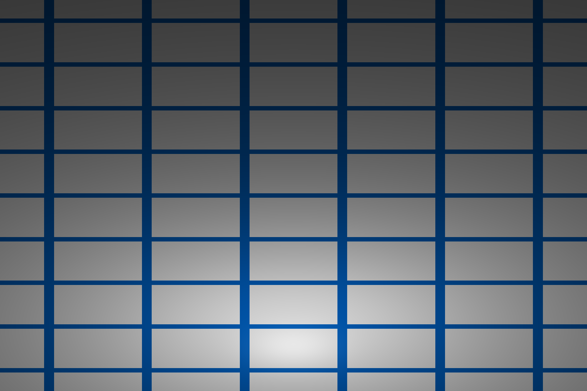

**Example:** Checkerboard texture with different materials

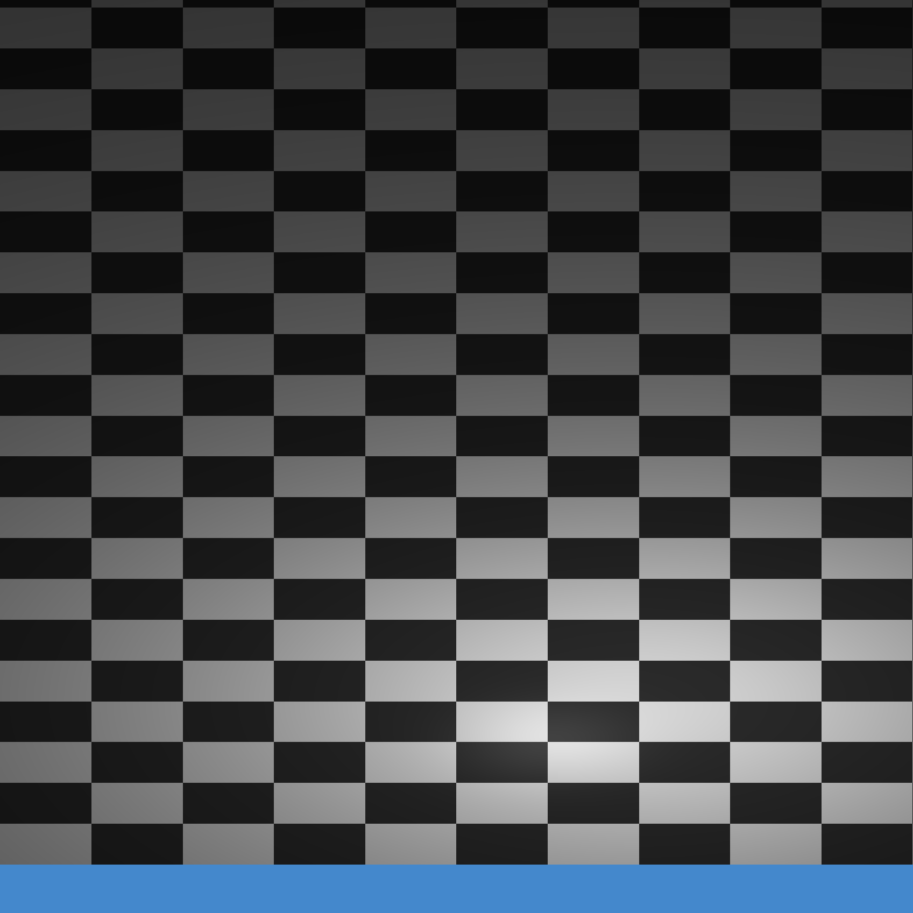

**Example:** Advanced checkerboard with reflective sphere

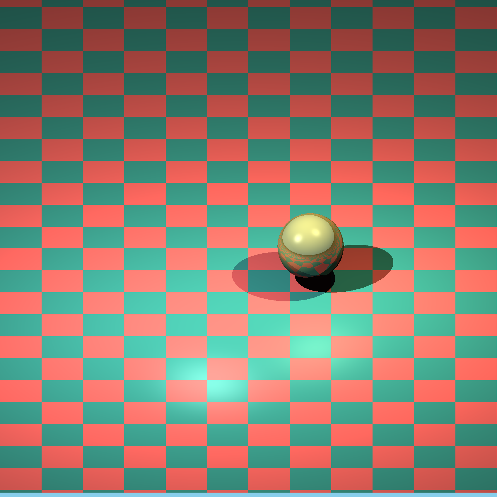

---

## Lighting

Lighting determines how your scene is illuminated. rtrace supports two types of light sources with different visual characteristics.

### Point Lights

Traditional point lights create sharp shadows and fast rendering:

```jsonc
{
  "lights": [
    {
      "position": [3, 3, 5],    // Light position in 3D space
      "color": "#FFFFFF",       // Light color
      "intensity": 1.0          // Light brightness (≥0)
    }
  ]
}
```

### Area Lights

Area lights simulate realistic light sources with soft shadows:

```jsonc
{
  "lights": [
    {
      "position": [2, 4, 3],
      "color": "#FFFFFF",
      "intensity": 1.0,
      "diameter": 2.0           // Light disk size (omit for point light)
    }
  ]
}
```

**Light Type Comparison:**
- **Point lights** (`diameter` omitted): Sharp shadows, fast rendering
- **Area lights** (`diameter` > 0): Soft shadows, realistic lighting, slower rendering

Area lights create natural shadow falloff and contact shadows similar to real-world lighting, but require more processing time.

**Example:** Multiple colored lights

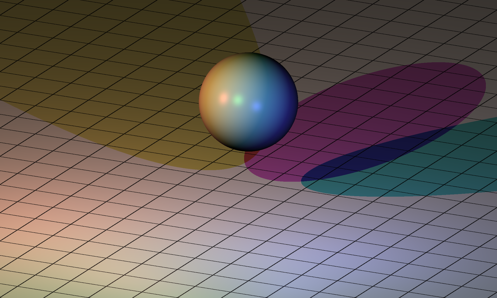

**Example:** Soft shadows from area lights

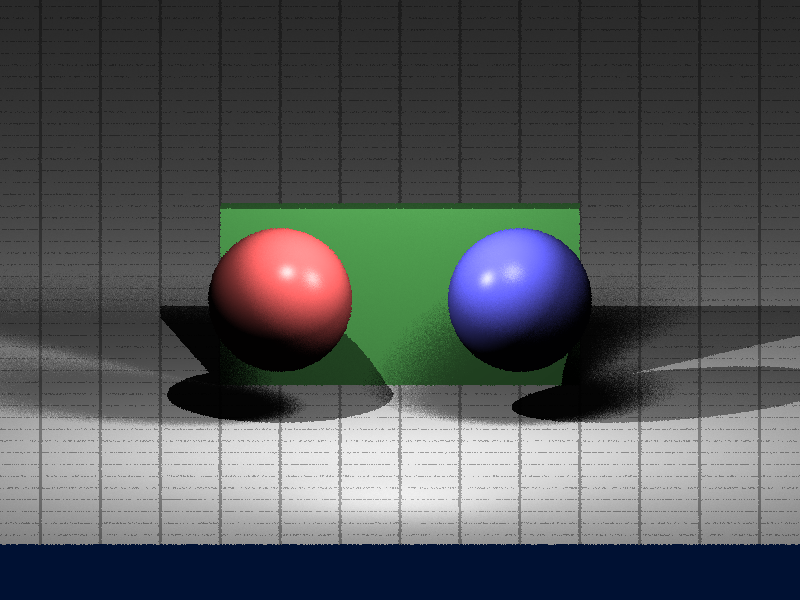

---

## Scene Settings

Global settings that affect the overall appearance of your rendered scene.

### Ambient Illumination

Base lighting that illuminates all surfaces uniformly, preventing completely dark shadows:

```jsonc
{
  "scene_settings": {
    "ambient_illumination": {
      "color": "#FFFFFF",       // Ambient light color
      "intensity": 0.1          // Ambient light strength (≥0)
    }
  }
}
```

### Background Color

Color displayed when rays don't hit any objects:

```jsonc
{
  "scene_settings": {
    "background_color": "#001122"  // Background color in hex format
  }
}
```

**Example:** Different background colors

| Dark Blue Background | Warm Background |
|:-------------------:|:---------------:|
| 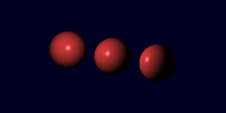 | 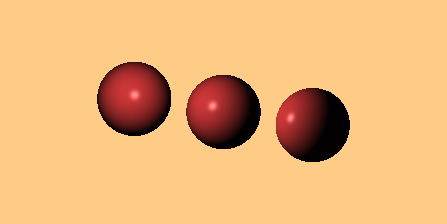 |

### Fog Effects

Atmospheric fog adds depth and realism to your scenes by gradually blending distant objects with the fog color:

```jsonc
{
  "scene_settings": {
    "fog": {
      "color": "#DDDDDD",       // Fog color
      "density": 0.1,           // Fog density factor (≥0, higher = thicker fog)
      "start": 2.0,             // Distance where fog begins (near distance)
      "end": 10.0               // Distance where fog calculation reaches maximum (far distance)
    }
  }
}
```

**How Fog Works:**

1. **Distance Calculation**: The distance from the camera to each rendered point is calculated
2. **Linear Interpolation**: Between `start` and `end` distances, a linear factor is computed:
   - At `start` distance: 0% fog influence
   - At `end` distance: 100% fog calculation applied
   - Beyond `end`: Maximum fog influence
3. **Exponential Density**: The linear factor is transformed using exponential fog: `1.0 - exp(-density * linear_factor)`
4. **Color Blending**: The final color is blended between the original color and fog color based on the fog factor

**Parameter Guidelines:**
- `start`: Distance where fog begins to appear (objects closer than this are unaffected)
- `end`: Distance where the fog calculation reaches its maximum intensity
- `density`: Controls how thick the fog becomes (0.1 = light fog, 0.5+ = heavy fog)
- `color`: The color that distant objects fade toward

**Example:** Fog density comparison

| Light Fog | Heavy Fog |
|:---------:|:---------:|
| 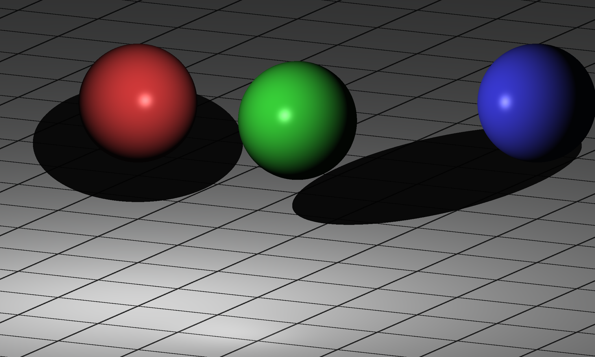 | 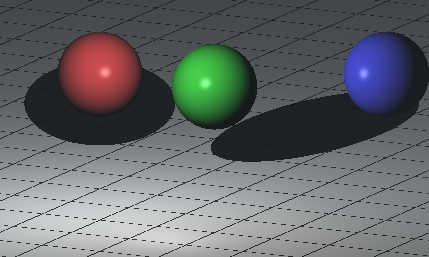 |

**Example:** Fog effect demonstration - near objects clear, distant objects fogged

This example shows how fog affects objects at different distances from the camera. The red sphere (closest) appears clear, while more distant objects progressively fade into the fog color.

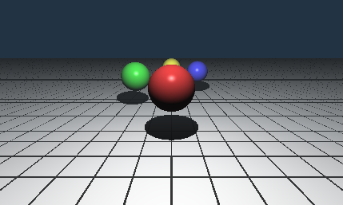

---

## Anti-Aliasing

Anti-aliasing reduces jagged edges and improves image quality by taking multiple samples per pixel.

### Quincunx

The default method uses 5 samples per pixel in a cross pattern for high-quality, predictable results:

```bash
# Default quincunx anti-aliasing (recommended)
./target/release/rtrace-cli -i scene.json -o output.png --anti-aliasing quincunx
```

### Stochastic  

Random sampling with configurable sample counts for flexible quality control:

```bash
# Stochastic with 4 samples per pixel
./target/release/rtrace-cli -i scene.json -o output.png --anti-aliasing stochastic --samples 4

# High quality with 16 samples
./target/release/rtrace-cli -i scene.json -o output.png --anti-aliasing stochastic --samples 16
```

### No Jitter

Single sample per pixel with no anti-aliasing - fastest rendering but may show jagged edges:

```bash
# No anti-aliasing (fastest)
./target/release/rtrace-cli -i scene.json -o output.png --anti-aliasing no-jitter
```

### Dynamic (Adaptive)

Automatically adjusts the sample count per pixel based on statistical convergence. Cheap flat regions get few samples; complex edges, reflections, and soft shadows get as many as needed to reach the target quality.

The renderer takes at least `--min-samples` samples, then keeps sampling until the **standard error of the mean** across all RGB channels drops below `--tolerance`, or `--max-samples` is reached.

```bash
# Adaptive sampling with defaults (min=4, max=256, tolerance=0.005)
./target/release/rtrace-cli -i scene.json -o output.png --anti-aliasing dynamic

# Tighter tolerance for higher quality (uses more samples where needed)
./target/release/rtrace-cli -i scene.json -o output.png --anti-aliasing dynamic --tolerance 0.001 --max-samples 512

# Quick preview with a loose tolerance
./target/release/rtrace-cli -i scene.json -o output.png --anti-aliasing dynamic --min-samples 2 --max-samples 32 --tolerance 0.02
```

| Parameter | Flag | Default | Meaning |
|-----------|------|---------|---------|
| Min samples | `--min-samples` | 4 | Samples taken before convergence checking begins (must be ≥ 2) |
| Max samples | `--max-samples` | 256 | Hard cap on samples per pixel |
| Tolerance | `--tolerance` | 0.005 | Target standard error (0.005 = 0.5% of full [0,1] color scale) |

**Performance Comparison:**
- **None**: Fastest (1 sample/px), may show aliasing
- **Quincunx**: Predictable quality (5 samples/px equivalent)
- **Stochastic**: Fixed sample count, uniform cost per pixel
- **Dynamic**: Spends samples where they matter — fast for simple areas, thorough on complex ones

**Visual Comparison:**

| No Anti-Aliasing | Quincunx (default) | Stochastic (4 samples) |
|:-----------------:|:------------------:|:----------------------:|
|  |  |  |

The difference is most noticeable on edges and fine details - anti-aliasing provides smoother, more professional-looking results.

**Basic Comparison:**

| No Anti-Aliasing | With Anti-Aliasing |
|:----------------:|:------------------:|
| 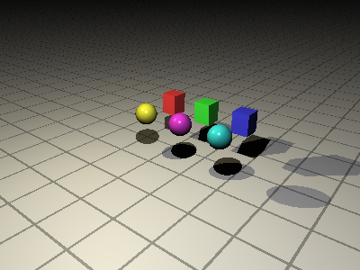 | 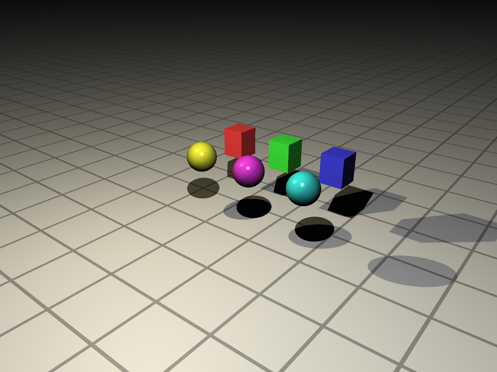 |

---

## Screen-Space Outline Detection

rtrace provides automatic outline detection using screen-space analysis of depth and normal discontinuities. This feature creates clean, customizable outlines that enhance technical illustrations, architectural visualizations, and stylized rendering workflows.

### How Outline Detection Works

The outline detection algorithm analyzes each pixel's depth and surface normals compared to neighboring pixels:

1. **Capture depth and normal data** during raytracing for every pixel
2. **Compute edge strength** using configurable weights for depth and normal differences
3. **Apply threshold** to determine which pixels should have outlines
4. **Composite outlines** over the final rendered image

The edge detection formula combines depth and normal discontinuities:
- Normal differences: `n_diff = 1 - dot(n_i, n_j)` (where n_i and n_j are neighboring normals)
- Depth differences: `z_diff = abs(z_i - z_j)` (absolute difference in camera-space depth)
- Combined edge strength: `E = w_d * z_diff + w_n * n_diff`
- Edge detection: if `E > T`, mark pixel as outline edge

### Configuration

Outline detection is configured entirely through scene JSON files in the `scene_settings.outline` section:

```jsonc
{
  "scene_settings": {
    "outline": {
      "enabled": true,            // Enable/disable outline detection
      "depth_weight": 1.0,        // Weight for depth discontinuities (w_d)
      "normal_weight": 1.5,       // Weight for normal discontinuities (w_n)
      "threshold": 0.08,          // Edge detection threshold (T)
      "color": "#000000",         // Outline color (hex format)
      "thickness": 1.5,           // Line thickness factor (≥1.0)
      "use_8_neighbors": false    // Use 8-neighbor vs 4-neighbor sampling
    }
  }
}
```

**Parameter Guidelines:**

| Parameter | Description | Typical Range | Effects |
|-----------|-------------|---------------|---------|
| `depth_weight` | Sensitivity to depth changes | 0.5 - 2.0 | Higher values detect depth edges more aggressively |
| `normal_weight` | Sensitivity to surface angle changes | 1.0 - 3.0 | Higher values emphasize silhouettes and creases |
| `threshold` | Edge detection sensitivity | 0.05 - 0.15 | Lower values = more outlines, higher = fewer outlines |
| `thickness` | Line width multiplier | 1.0 - 3.0 | 1.0 = single pixel, 2.0 = roughly double width |
| `use_8_neighbors` | Sampling pattern | true/false | 8-neighbor gives denser outlines, 4-neighbor is faster |

### Basic Usage

Create a scene with outline detection by adding the outline configuration to `scene_settings`:

```jsonc
{
  "camera": { /* camera settings */ },
  "objects": [ /* scene objects */ ],
  "lights": [ /* lighting setup */ ],
  "scene_settings": {
    "ambient_illumination": { /* ambient settings */ },
    "background_color": "#E8F4F8",
    "outline": {
      "enabled": true,
      "depth_weight": 1.0,
      "normal_weight": 1.5,
      "threshold": 0.08,
      "color": "#000000",
      "thickness": 1.5,
      "use_8_neighbors": false
    }
  }
}
```

Then render normally with the CLI:

```bash
# Render scene with outline detection
./target/release/rtrace-cli -i scene_with_outlines.json -o output.png -s 800
```

### Visual Examples

**Basic outline demonstration** with geometric objects:

| Without Outlines | With Outlines |
|:----------------:|:-------------:|
| 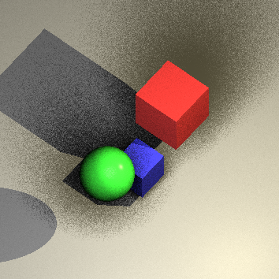 | 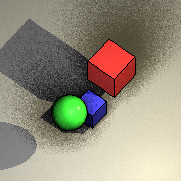 |

**Complex scene** with advanced outline parameters:

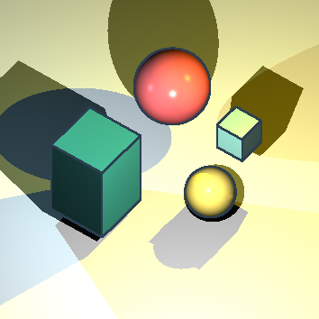

### Parameter Tuning Tips

**For technical illustrations:**
- Use higher `normal_weight` (1.5-2.0) to emphasize object silhouettes
- Set `depth_weight` to 0.8-1.2 for moderate depth edge detection
- Use `threshold` around 0.06-0.08 for clean lines
- Set `thickness` to 1.5-2.0 for visible but not overwhelming lines

**For artistic effects:**
- Increase `thickness` to 2.0+ for bold outlines
- Lower `threshold` to 0.05 or below for more detailed edge detection
- Experiment with colored outlines (non-black `color` values)
- Use `use_8_neighbors: true` for denser outline coverage

**Performance considerations:**
- Outline detection adds approximately 10% rendering overhead
- `use_8_neighbors: false` (4-neighbor) is faster than 8-neighbor sampling
- **Anti-aliasing compatibility**: Outline detection works with `stochastic` and `no-jitter` anti-aliasing modes. When using the default `quincunx` mode with outline detection enabled, the renderer automatically switches to `no-jitter` mode with a warning message.

**Anti-aliasing mode behavior:**
- `quincunx` (default): Automatically falls back to `no-jitter` when outlines are enabled
- `stochastic`: Fully compatible with outline detection
- `no-jitter`: Fully compatible with outline detection

### Example Scenes

rtrace includes two example scenes demonstrating outline functionality:

- **`examples/outline_demo.json`**: Basic outline demo with simple geometric objects
- **`doc/scenes/outline_complex.json`**: Complex scene showcasing advanced outline parameters with multiple objects and lighting

Both scenes include different outline parameter configurations to demonstrate the range of visual effects possible.

---

## Examples

### Complete Scene Example

Here's a comprehensive scene demonstrating multiple features working together:

```jsonc
{
  "camera": {
    "kind": "ortho",
    "position": [5, 5, 8],
    "target": [0, 0, 0],
    "up": [0, 1, 0],
    "width": 8,
    "height": 6
  },
  "objects": [
    {
      // Red sphere with basic material
      "kind": "sphere",
      "center": [-2, 1, 0],
      "radius": 1.0,
      "material": {
        "color": "#FF4444",
        "ambient": 0.1,
        "diffuse": 0.7,
        "specular": 0.3,
        "shininess": 32
      }
    },
    {
      // Blue reflective cube
      "kind": "cube", 
      "center": [2, 0, 0],
      "size": [1.5, 1.5, 1.5],
      "material": {
        "color": "#4444FF",
        "ambient": 0.1,
        "diffuse": 0.8,
        "specular": 0.5,
        "shininess": 64,
        "reflectivity": 0.3
      }
    },
    {
      // Ground plane with grid texture
      "kind": "plane",
      "point": [0, -2, 0],
      "normal": [0, 1, 0],
      "material": {
        "color": "#FFFFFF",
        "ambient": 0.2,
        "diffuse": 0.8,
        "specular": 0.1,
        "shininess": 10,
        "texture": {
          "type": "grid",
          "line_color": "#333333",
          "line_width": 0.05,
          "cell_size": 1.0
        }
      }
    }
  ],
  "lights": [
    {
      // Main white light
      "position": [3, 4, 5],
      "color": "#FFFFFF",
      "intensity": 1.0
    },
    {
      // Secondary warm light
      "position": [-3, 2, 3],
      "color": "#FFAAAA", 
      "intensity": 0.6
    }
  ],
  "scene_settings": {
    "ambient_illumination": {
      "color": "#FFFFFF",
      "intensity": 0.15
    },
    "background_color": "#223344",
    "fog": {
      "color": "#AACCDD",
      "density": 0.05,
      "start": 3.0,
      "end": 12.0
    }
  }
}
```

**Result:** Complete scene with sphere, cube, textured plane, multiple lights, and fog

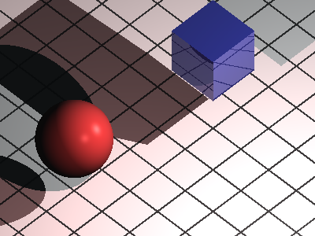

This example demonstrates:
- Multiple object types (sphere, cube, plane)
- Different materials (basic, reflective, textured)
- Multiple light sources with different colors
- Atmospheric fog for depth
- Orthographic camera with good framing

---

## Deterministic Rendering

rtrace produces **consistent, reproducible results** - the same scene will always generate identical images, making it perfect for version control, collaboration, and reliable output.

### Benefits

- **Reproducible renders**: Perfect for version control and debugging
- **Consistent results**: Same scene always produces same output across different systems
- **Thread-independent**: Results don't depend on CPU core count or scheduling
- **Reliable testing**: Eliminates randomness-related inconsistencies

### Usage

All rendering is deterministic by default:

```bash
# These commands always produce identical results
./target/release/rtrace-cli --input scene.json --output render1.png
./target/release/rtrace-cli --input scene.json --output render2.png
# render1.png and render2.png are byte-for-byte identical
```

This applies to all anti-aliasing modes, including stochastic and dynamic sampling - even "random" sampling uses controlled randomness for predictable results.

---

## JavaScript API Examples

rtrace provides powerful Node.js bindings that allow you to render scenes directly in JavaScript and manipulate the resulting image buffers.

### Direct Buffer Manipulation Example

The JavaScript API includes a special `renderSceneToBuffer()` function that returns an `ImageBuffer` object with explicit width, height, stride, and pixel data, enabling safe and efficient direct pixel manipulation before saving to disk.

**Example:** [`doc/js-buffer-example.js`](js-buffer-example.js)

This comprehensive example demonstrates:

1. **Direct API Usage**: Creating scenes programmatically without intermediate JSON files
2. **Buffer Rendering**: Using `renderSceneToBuffer()` to get structured image buffer with metadata
3. **Image Manipulation**: Processing the buffer in JavaScript (color negation on left half)
4. **File Output**: Converting the manipulated buffer to PNG format

**Key Features Demonstrated:**
- Complex scene with multiple objects, materials, and lighting
- Reflective surfaces with checkerboard textures
- Area lights for soft shadows
- Atmospheric fog effects
- Real-time buffer manipulation (153,600 pixels processed in ~4ms)

**Sample Output:**

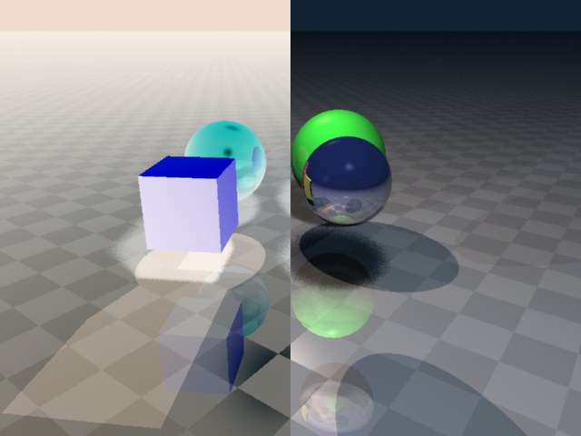

The resulting image shows the power of direct buffer access:
- **Right Half**: Original rendered scene with reflections and fog
- **Left Half**: Color-negated version demonstrating buffer manipulation

**Usage:**
```bash
# Run the JavaScript buffer manipulation example
cd /path/to/rtrace
node doc/js-buffer-example.js
```

**JavaScript API Functions:**

| Function | Description | Return Type |
|----------|-------------|-------------|
| `renderScene(sceneJson, outputPath, size)` | Render scene to PNG file | `string` (status message) |
| `renderSceneToBuffer(sceneJson, size)` | Render scene to image buffer with metadata | `ImageBuffer` object |
| `renderSceneThreaded(sceneJson, outputPath, size, threads)` | Multi-threaded file render | `string` (status message) |

The `renderSceneToBuffer()` function returns an `ImageBuffer` object with the following structure:

```typescript
interface ImageBuffer {
  width: number;    // Image width in pixels
  height: number;   // Image height in pixels  
  stride: number;   // Bytes per row (width * 4 for RGBA)
  data: number[];   // Raw RGBA pixel data (4 bytes per pixel: R, G, B, A)
}
```

This explicit metadata structure eliminates stride calculation errors and allows for:
- Real-time image processing and effects
- Custom output formats beyond PNG
- Integration with web-based image processing libraries
- Batch processing and analysis workflows

