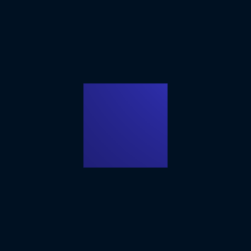
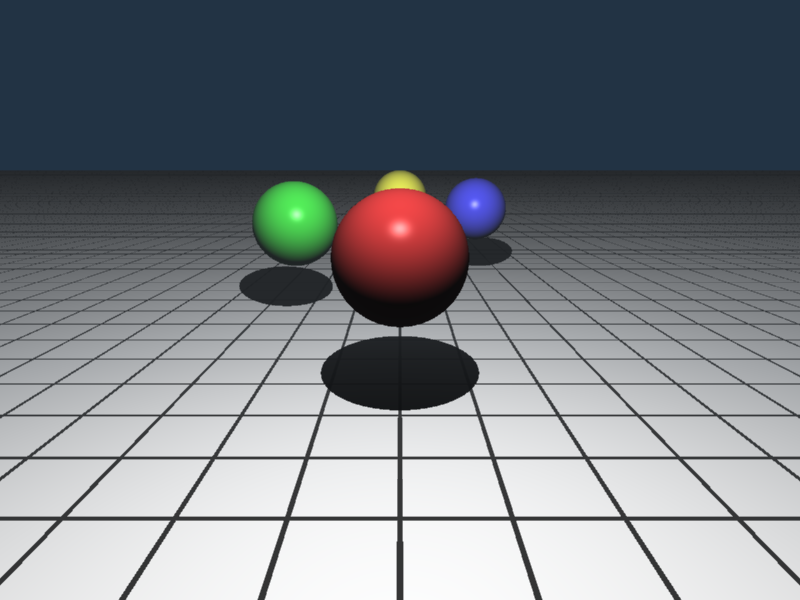
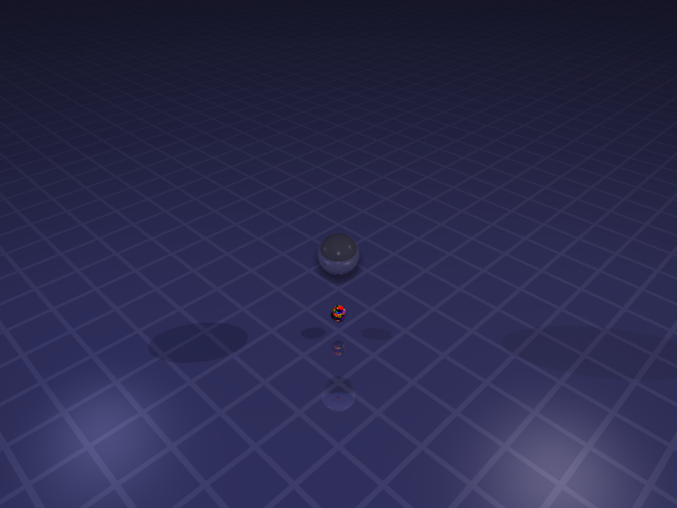

# rtrace Ray Tracer Documentation

This comprehensive guide covers all features and options available in the rtrace ray tracer, including scene format reference, command-line usage, and visual examples.

## Table of Contents

1. [Command Line Interface](#command-line-interface)
2. [Scene Format Overview](#scene-format-overview)

### Scene Configuration
3. [Camera](#camera)
   - [Orthographic Camera](#orthographic-camera)
   - [Perspective Camera](#perspective-camera)
   - [Grid Background](#grid-background)
4. [Objects](#objects)
   - [Sphere](#sphere)
   - [Plane](#plane)
   - [Cube](#cube)
   - [Mesh (STL)](#mesh-stl)
   - [Object Transforms](#object-transforms)
5. [Materials](#materials)
   - [Basic Properties](#basic-properties)
   - [Reflectivity](#reflectivity)
   - [Textures](#textures)
6. [Lighting](#lighting)
   - [Point Lights](#point-lights)
   - [Area Lights](#area-lights)

### Rendering Configuration
7. [Scene Settings](#scene-settings)
   - [Ambient Illumination](#ambient-illumination)
   - [Background Color](#background-color)
   - [Fog Effects](#fog-effects)
8. [Anti-Aliasing](#anti-aliasing)
   - [Quincunx](#quincunx)
   - [Stochastic](#stochastic)
   - [No Jitter](#no-jitter)

### Advanced Topics
9. [Deterministic Rendering](#deterministic-rendering)
10. [Examples](#examples)

---

## Command Line Interface

The rtrace CLI tool renders scenes from JSON files to PNG images.

### Usage

```bash
./target/release/rtrace [OPTIONS] --input <INPUT> --output <OUTPUT>
```

### Options

| Option | Short | Description | Default |
|--------|-------|-------------|---------|
| `--input <INPUT>` | `-i` | Input JSON scene file (required) | - |
| `--output <OUTPUT>` | `-o` | Output PNG image file (required) | - |
| `--width <WIDTH>` | `-w` | Image width in pixels | 800 |
| `--height <HEIGHT>` | `-H` | Image height in pixels | 600 |
| `--max-depth <MAX_DEPTH>` | - | Maximum ray bounces for reflections | 10 |
| `--samples <SAMPLES>` | - | Number of samples per pixel | Auto (5 for quincunx) |
| `--anti-aliasing <MODE>` | - | Anti-aliasing mode: quincunx, stochastic, or no-jitter | quincunx |
| `--help` | `-h` | Print help information | - |
| `--version` | `-V` | Print version information | - |

### Example Commands

```bash
# Basic rendering (uses quincunx anti-aliasing by default)
./target/release/rtrace -i examples/simple_sphere.json -o output.png

# Custom resolution
./target/release/rtrace -i scene.json -o high_res.png -w 1920 -H 1080

# High reflection depth for mirror effects
./target/release/rtrace -i mirror_scene.json -o mirrors.png --max-depth 20

# Deterministic rendering (no anti-aliasing)
./target/release/rtrace -i scene.json -o deterministic.png --anti-aliasing no-jitter

# Stochastic anti-aliasing with 4 samples
./target/release/rtrace -i scene.json -o stochastic.png --anti-aliasing stochastic --samples 4

# High-quality quincunx anti-aliasing (default, 5 samples)
./target/release/rtrace -i scene.json -o smooth.png --anti-aliasing quincunx
```

---

## Scene Format Overview

Scenes are defined in JSON format. Every scene requires four main sections:

```jsonc
{
  "camera": { /* Camera configuration */ },
  "objects": [ /* Array of objects in the scene */ ],
  "lights": [ /* Array of light sources */ ],
  "scene_settings": { /* Global scene settings */ }
}
```

---

## Camera

The camera determines the view and perspective of your scene. rtrace supports orthographic and perspective cameras, each with different properties and use cases.

### Orthographic Camera

Orthographic cameras provide parallel projection with no perspective distortion - useful for technical drawings and architectural views.

```jsonc
{
  "camera": {
    "kind": "ortho",
    "position": [0, 0, 10],
    "target": [0, 0, 0], 
    "up": [0, 1, 0],
    "width": 6,
    "height": 6
  }
}
```

| Property | Type | Description |
|----------|------|-------------|
| `kind` | string | Camera type, must be `"ortho"` |
| `position` | [x, y, z] | Camera position in 3D space |
| `target` | [x, y, z] | Point the camera looks at |
| `up` | [x, y, z] | Camera up vector (typically [0, 0, 1] for Z-up) |
| `width` | number | Viewport width in world units |
| `height` | number | Viewport height in world units |
| `grid_pitch` | number (optional) | Distance between grid lines for background grid |
| `grid_color` | string (optional) | Hex color for grid lines (e.g., "#444444") |
| `grid_thickness` | number (optional) | Thickness of grid lines in world units |

### Grid Background

Orthographic cameras can display coordinate grid lines in the background when rays miss all objects. This feature helps with spatial reference and technical drawings.

```jsonc
{
  "camera": {
    "kind": "ortho",
    "position": [3, 3, 8],
    "target": [0, 0, 0],
    "up": [0, 1, 0], 
    "width": 8,
    "height": 6,
    "grid_pitch": 1.0,      // Distance between grid lines
    "grid_color": "#444444", // Grid line color
    "grid_thickness": 0.05   // Line thickness in world units
  }
}
```

**Grid Properties:**
- `grid_pitch`: Distance between grid lines (e.g., 1.0 creates lines at x=0, x=1, x=2, etc.)
- `grid_color`: Color of the grid lines in hex format
- `grid_thickness`: Width of the grid lines in world units

All three grid properties must be specified for the grid to appear. Grid backgrounds only work with orthographic cameras and appear on the world coordinate planes (XY, XZ, and YZ) centered at the origin.

**Example:** Technical drawing with coordinate grid


### Perspective Camera

Perspective cameras provide realistic 3D viewing with depth perspective, similar to how human eyes see the world.

```jsonc
{
  "camera": {
    "kind": "perspective",
    "position": [0, 2, 5],
    "target": [0, 0, 0],
    "up": [0, 1, 0],
    "width": 8,
    "height": 6,
    "fov": 60
  }
}
```

| Property | Type | Description |
|----------|------|-------------|
| `kind` | string | Camera type, must be `"perspective"` |
| `position` | [x, y, z] | Camera position in 3D space |
| `target` | [x, y, z] | Point the camera looks at |
| `up` | [x, y, z] | Camera up vector (typically [0, 0, 1] for Z-up) |
| `width` | number | Viewport width in world units |
| `height` | number | Viewport height in world units |
| `fov` | number | Field of view angle in degrees |

---

## Objects

Objects define the 3D geometry in your scene. rtrace supports four types of objects: spheres, planes, cubes, and triangle meshes from STL files.

### Sphere

Spheres are perfect for creating balls, planets, or any round object.

```jsonc
{
  "kind": "sphere",
  "center": [0, 0, 0],
  "radius": 1.5,
  "material": { /* material properties */ }
}
```

**Example:** Simple red sphere


### Plane

Infinite flat surfaces, perfect for ground, walls, or any flat surface in your scene.

```jsonc
{
  "kind": "plane",
  "point": [0, -2, 0],
  "normal": [0, 1, 0],
  "material": { /* material properties */ }
}
```

**Example:** Textured ground plane


### Cube

Rectangular boxes aligned with coordinate axes, ideal for buildings, containers, or geometric shapes.

```jsonc
{
  "kind": "cube",
  "center": [0, 0, 0],
  "size": [2, 2, 2],
  "material": { /* material properties */ }
}
```

**Example:** Blue cube



### Mesh (STL)

Complex 3D models from STL files (ASCII or binary format), perfect for importing detailed geometry.

```jsonc
{
  "kind": "mesh",
  "filename": "models/example.stl",
  "material": { /* material properties */ }
}
```

**Example:** STL mesh model


### Object Transforms

All objects (spheres, planes, cubes, and meshes) support optional transform operations for flexible positioning, rotation, and scaling. Transforms allow you to precisely place and orient objects in your scene without modifying the base geometry.

#### Transform Operations

rtrace supports three types of transforms that can be combined in any order:

**Rotation** - `"rotate(x, y, z)"`
- Rotates object around the X, Y, and Z axes
- Values are in degrees (e.g., 90, 180, 270)
- Rotation order: Z-axis → Y-axis → X-axis

**Translation** - `"translate(x, y, z)"`  
- Moves object along the X, Y, and Z axes
- Values are in world coordinate units
- Positive values move in positive axis directions

**Scaling** - `"scale(x, y, z)"`
- Scales object size along the X, Y, and Z axes
- Values are scale factors (1.0 = original size, 2.0 = double, 0.5 = half)
- Different values per axis allow stretching/squashing

#### Transform Syntax

Transforms are defined as an optional array of strings in any object:

```jsonc
{
  "kind": "sphere",
  "center": [0, 0, 0],
  "radius": 1.0,
  "material": { /* ... */ },
  "transform": [
    "rotate(0, 0, 45)",      // Rotate 45° around Z-axis
    "translate(3, 1, 0)",    // Move 3 units right, 1 unit up
    "scale(2, 1, 1)"         // Double width, keep height/depth
  ]
}
```

#### Transform Order

Transforms are applied in the order they appear in the array. This order matters for the final result:

```jsonc
// Option 1: Scale, then translate
"transform": [
  "scale(2, 2, 2)",
  "translate(5, 0, 0)"
]

// Option 2: Translate, then scale  
"transform": [
  "translate(5, 0, 0)",
  "scale(2, 2, 2)"
]
```

In Option 1, the object is doubled in size, then moved 5 units along X-axis.
In Option 2, the object is moved 5 units, then doubled (so it ends up 10 units along X-axis).

#### Practical Examples

**Rotating a cube 45 degrees:**
```jsonc
{
  "kind": "cube",
  "center": [0, 0, 0],
  "size": [2, 2, 2],
  "material": { "color": "#4444FF", /* ... */ },
  "transform": ["rotate(0, 0, 45)"]
}
```

**Creating a scaled and positioned mesh:**
```jsonc
{
  "kind": "mesh",
  "filename": "model.stl",
  "material": { "color": "#FF8080", /* ... */ },
  "transform": [
    "scale(8, 8, 8)",        // Make 8x larger
    "rotate(0, 0, 180)",     // Flip upside down
    "translate(15, 0, 0)"    // Move to the right
  ]
}
```

**Multiple objects with different transforms:**
```jsonc
{
  "objects": [
    {
      "kind": "sphere",
      "center": [0, 0, 0],
      "radius": 1,
      "material": { "color": "#FF4444", /* ... */ },
      "transform": ["translate(-3, 0, 0)"]
    },
    {
      "kind": "sphere", 
      "center": [0, 0, 0],
      "radius": 1,
      "material": { "color": "#4444FF", /* ... */ },
      "transform": [
        "scale(1.5, 1.5, 1.5)",
        "translate(3, 0, 0)"
      ]
    }
  ]
}
```

**Example:** Transform demonstration with two mesh objects


#### Transform Notes

**Performance:** Transforms are applied during scene setup, not during rendering, so they don't affect render performance.

**Coordinate System:** rtrace uses a right-handed Z-up coordinate system optimized for 3D printing workflows:
- +X points right
- +Y points forward (away from viewer)
- +Z points up

**Mesh Transforms:** For STL meshes, transforms are applied to all vertices, and spatial acceleration structures (like K-d trees) are rebuilt automatically.

**Precision:** All transform calculations use 64-bit floating-point math for high precision.

---

## Materials

Materials define how objects appear and interact with light in your scene.

### Basic Properties

Every material needs basic color and lighting properties:

```jsonc
{
  "material": {
    "color": "#FF4444",      // Base color as hex string
    "ambient": 0.1,          // How much ambient light to reflect (0.0-1.0)
    "diffuse": 0.8,          // How much direct light to scatter (0.0-1.0)
    "specular": 0.4,         // How much light to reflect as highlights (0.0-1.0)
    "shininess": 32          // Size of highlights (higher = smaller, sharper)
  }
}
```

**Example:** Material property comparison


### Reflectivity

Add mirror-like reflections to create realistic shiny surfaces:

```jsonc
{
  "material": {
    "color": "#CCCCCC",
    "ambient": 0.1,
    "diffuse": 0.3,
    "specular": 0.8,
    "shininess": 100,
    "reflectivity": 0.7      // Reflection strength (0.0=no reflection, 1.0=perfect mirror)
  }
}
```

**Example:** Reflective spheres


### Textures

Add patterns to surfaces. rtrace supports grid patterns and checkerboard patterns for planes:

#### Grid Texture

Creates grid lines on a surface:

```jsonc
{
  "material": {
    "color": "#FFFFFF",
    "ambient": 0.2,
    "diffuse": 0.8,
    "specular": 0.1,
    "shininess": 10,
    "texture": {
      "type": "grid",           // Pattern type
      "line_color": "#333333",  // Grid line color
      "line_width": 0.1,        // Grid line thickness in world units
      "cell_size": 1.0          // Size of each grid cell
    }
  }
}
```

#### Checkerboard Texture

Creates alternating squares with independent material properties. Each square is exactly 1x1 world units, and you can use object transforms to scale as needed:

```jsonc
{
  "material": {
    "color": "#FFFFFF",        // Base color (not used with checkerboard)
    "ambient": 0.2,
    "diffuse": 0.8,
    "specular": 0.1,
    "shininess": 10,
    "texture": {
      "type": "checkerboard",
      "material_a": {           // First checkerboard material
        "color": "#FF6B6B",     // Independent color
        "ambient": 0.15,        // Independent lighting properties
        "diffuse": 0.9,
        "specular": 0.8,
        "shininess": 64.0
      },
      "material_b": {           // Second checkerboard material
        "color": "#4ECDC4",     // Independent color  
        "ambient": 0.3,         // Independent lighting properties
        "diffuse": 0.6,
        "specular": 0.2,
        "shininess": 16.0
      }
    }
  }
}
```

**Key Features:**
- Each checkerboard square uses completely independent material properties (color, shininess, reflectivity, etc.)
- Pattern uses 1x1 world units - use object transforms to scale the pattern
- Works on planes, cubes, and STL meshes that have texture coordinates

**Example:** Different material configurations


**Example:** Reflective surfaces


**Example:** Grid texture patterns


**Example:** Checkerboard texture with different materials


**Example:** Advanced checkerboard with reflective sphere


---

## Lighting

Lighting determines how your scene is illuminated. rtrace supports two types of light sources with different visual characteristics.

### Point Lights

Traditional point lights create sharp shadows and fast rendering:

```jsonc
{
  "lights": [
    {
      "position": [3, 3, 5],    // Light position in 3D space
      "color": "#FFFFFF",       // Light color
      "intensity": 1.0          // Light brightness (≥0)
    }
  ]
}
```

### Area Lights

Area lights simulate realistic light sources with soft shadows:

```jsonc
{
  "lights": [
    {
      "position": [2, 4, 3],
      "color": "#FFFFFF",
      "intensity": 1.0,
      "diameter": 2.0           // Light disk size (omit for point light)
    }
  ]
}
```

**Light Type Comparison:**
- **Point lights** (`diameter` omitted): Sharp shadows, fast rendering
- **Area lights** (`diameter` > 0): Soft shadows, realistic lighting, slower rendering

Area lights create natural shadow falloff and contact shadows similar to real-world lighting, but require more processing time.

**Example:** Multiple colored lights


**Example:** Soft shadows from area lights


---

## Scene Settings

Global settings that affect the overall appearance of your rendered scene.

### Ambient Illumination

Base lighting that illuminates all surfaces uniformly, preventing completely dark shadows:

```jsonc
{
  "scene_settings": {
    "ambient_illumination": {
      "color": "#FFFFFF",       // Ambient light color
      "intensity": 0.1          // Ambient light strength (≥0)
    }
  }
}
```

### Background Color

Color displayed when rays don't hit any objects:

```jsonc
{
  "scene_settings": {
    "background_color": "#001122"  // Background color in hex format
  }
}
```

**Example:** Different background colors

| Dark Blue Background | Warm Background |
|:-------------------:|:---------------:|
|  |  |

### Fog Effects

Atmospheric fog adds depth and realism to your scenes by gradually blending distant objects with the fog color:

```jsonc
{
  "scene_settings": {
    "fog": {
      "color": "#DDDDDD",       // Fog color
      "density": 0.1,           // Fog density factor (≥0, higher = thicker fog)
      "start": 2.0,             // Distance where fog begins (near distance)
      "end": 10.0               // Distance where fog calculation reaches maximum (far distance)
    }
  }
}
```

**How Fog Works:**

1. **Distance Calculation**: The distance from the camera to each rendered point is calculated
2. **Linear Interpolation**: Between `start` and `end` distances, a linear factor is computed:
   - At `start` distance: 0% fog influence
   - At `end` distance: 100% fog calculation applied
   - Beyond `end`: Maximum fog influence
3. **Exponential Density**: The linear factor is transformed using exponential fog: `1.0 - exp(-density * linear_factor)`
4. **Color Blending**: The final color is blended between the original color and fog color based on the fog factor

**Parameter Guidelines:**
- `start`: Distance where fog begins to appear (objects closer than this are unaffected)
- `end`: Distance where the fog calculation reaches its maximum intensity
- `density`: Controls how thick the fog becomes (0.1 = light fog, 0.5+ = heavy fog)
- `color`: The color that distant objects fade toward

**Example:** Fog density comparison

| Light Fog | Heavy Fog |
|:---------:|:---------:|
|  |  |

**Example:** Fog effect demonstration - near objects clear, distant objects fogged

This example shows how fog affects objects at different distances from the camera. The red sphere (closest) appears clear, while more distant objects progressively fade into the fog color.



---

## Anti-Aliasing

Anti-aliasing reduces jagged edges and improves image quality by taking multiple samples per pixel.

### Quincunx

The default method uses 5 samples per pixel in a cross pattern for high-quality, predictable results:

```bash
# Default quincunx anti-aliasing (recommended)
./target/release/rtrace -i scene.json -o output.png --anti-aliasing quincunx
```

### Stochastic  

Random sampling with configurable sample counts for flexible quality control:

```bash
# Stochastic with 4 samples per pixel
./target/release/rtrace -i scene.json -o output.png --anti-aliasing stochastic --samples 4

# High quality with 16 samples
./target/release/rtrace -i scene.json -o output.png --anti-aliasing stochastic --samples 16
```

### No Jitter

Single sample per pixel with no anti-aliasing - fastest rendering but may show jagged edges:

```bash
# No anti-aliasing (fastest)
./target/release/rtrace -i scene.json -o output.png --anti-aliasing no-jitter
```

**Performance Comparison:**
- **No Jitter**: Fastest (1x), predictable results, may show aliasing
- **Quincunx**: High quality (5x), predictable results
- **Stochastic**: Flexible quality (1x to 16x+), randomized results

**Visual Comparison:**

| No Anti-Aliasing | Quincunx (default) | Stochastic (4 samples) |
|:-----------------:|:------------------:|:----------------------:|
|  |  |  |

The difference is most noticeable on edges and fine details - anti-aliasing provides smoother, more professional-looking results.

**Basic Comparison:**

| No Anti-Aliasing | With Anti-Aliasing |
|:----------------:|:------------------:|
|  |  |

---

## Examples

### Complete Scene Example

Here's a comprehensive scene demonstrating multiple features working together:

```jsonc
{
  "camera": {
    "kind": "ortho",
    "position": [5, 5, 8],
    "target": [0, 0, 0],
    "up": [0, 1, 0],
    "width": 8,
    "height": 6
  },
  "objects": [
    {
      // Red sphere with basic material
      "kind": "sphere",
      "center": [-2, 1, 0],
      "radius": 1.0,
      "material": {
        "color": "#FF4444",
        "ambient": 0.1,
        "diffuse": 0.7,
        "specular": 0.3,
        "shininess": 32
      }
    },
    {
      // Blue reflective cube
      "kind": "cube", 
      "center": [2, 0, 0],
      "size": [1.5, 1.5, 1.5],
      "material": {
        "color": "#4444FF",
        "ambient": 0.1,
        "diffuse": 0.8,
        "specular": 0.5,
        "shininess": 64,
        "reflectivity": 0.3
      }
    },
    {
      // Ground plane with grid texture
      "kind": "plane",
      "point": [0, -2, 0],
      "normal": [0, 1, 0],
      "material": {
        "color": "#FFFFFF",
        "ambient": 0.2,
        "diffuse": 0.8,
        "specular": 0.1,
        "shininess": 10,
        "texture": {
          "type": "grid",
          "line_color": "#333333",
          "line_width": 0.05,
          "cell_size": 1.0
        }
      }
    }
  ],
  "lights": [
    {
      // Main white light
      "position": [3, 4, 5],
      "color": "#FFFFFF",
      "intensity": 1.0
    },
    {
      // Secondary warm light
      "position": [-3, 2, 3],
      "color": "#FFAAAA", 
      "intensity": 0.6
    }
  ],
  "scene_settings": {
    "ambient_illumination": {
      "color": "#FFFFFF",
      "intensity": 0.15
    },
    "background_color": "#223344",
    "fog": {
      "color": "#AACCDD",
      "density": 0.05,
      "start": 3.0,
      "end": 12.0
    }
  }
}
```

**Result:** Complete scene with sphere, cube, textured plane, multiple lights, and fog


This example demonstrates:
- Multiple object types (sphere, cube, plane)
- Different materials (basic, reflective, textured)
- Multiple light sources with different colors
- Atmospheric fog for depth
- Orthographic camera with good framing

---

## JavaScript API Examples

The rtrace Node.js bindings allow you to programmatically generate complex scenes using JavaScript. These examples demonstrate advanced procedural generation techniques and mathematical patterns.

### Rainbow Spiral Scene

A stunning demonstration of programmatic scene generation using arcs of cubes arranged in rainbow colors. Each cube is precisely positioned and rotated to be tangent to its arc path, with spiral effects creating dynamic height and radius variations.

**Features Demonstrated:**
- Programmatic generation of complex geometric patterns
- Mathematical arc and spiral calculations using trigonometry
- Object transformations (rotation and translation) for precise positioning
- Rainbow color progression (ROYGBIV: Red, Orange, Yellow, Green, Blue, Indigo, Violet)
- Tangent rotation alignment - cubes oriented along arc curves
- Spiral effects with height and radius variations
- Advanced lighting with area lights and soft shadows
- Atmospheric fog effects for enhanced depth perception
- Reflective materials and surfaces
- Perspective camera with optimal 3D framing

**JavaScript Implementation:**
```javascript
const rtrace = require('../rtrace.node');

// Rainbow colors (ROYGBIV)
const rainbowColors = [
    { name: 'Red',    color: '#FF0000' },
    { name: 'Orange', color: '#FF8000' },
    { name: 'Yellow', color: '#FFFF00' },
    { name: 'Green',  color: '#00FF00' },
    { name: 'Blue',   color: '#0080FF' },
    { name: 'Indigo', color: '#4000FF' },
    { name: 'Violet', color: '#8000FF' }
];

// Calculate position along an arc with spiral effect
function calculateArcPosition(baseRadius, arcAngle, spiralHeight, spiralRadius) {
    const x = Math.cos(arcAngle) * (baseRadius + spiralRadius);
    const y = Math.sin(arcAngle) * (baseRadius + spiralRadius);
    const z = spiralHeight;
    return [x, y, z];
}

// Calculate tangent rotation for cube to align with arc direction
function calculateTangentRotation(arcAngle, tiltAngle = 0) {
    const zRotation = (arcAngle * 180 / Math.PI) + 90; // +90 to be tangent
    return [tiltAngle, 0, zRotation];
}

// Create cubes with transforms
rainbowColors.forEach((colorInfo, colorIndex) => {
    const arcStartAngle = (colorIndex / rainbowColors.length) * Math.PI * 2;
    
    for (let i = 0; i < numCubesPerArc; i++) {
        const arcProgress = i / (numCubesPerArc - 1);
        const currentAngle = arcStartAngle + (arcProgress * arcSpanAngle);
        
        // Add spiral effects
        const spiralPhase = (colorIndex * 0.5) + (arcProgress * 4);
        const heightVariation = Math.sin(spiralPhase) * spiralHeight;
        const radiusVariation = Math.cos(spiralPhase * 1.3) * spiralRadius;
        
        const position = calculateArcPosition(baseRadius, currentAngle, 
            3 + heightVariation, radiusVariation);
        const rotation = calculateTangentRotation(currentAngle, 
            Math.sin(spiralPhase) * 30);
        
        scene.objects.push({
            kind: "cube",
            center: [0, 0, 0],
            size: [0.3, 0.3, 0.3],
            material: { color: colorInfo.color, /* ... */ },
            transform: [
                `rotate(${rotation[0]}, ${rotation[1]}, ${rotation[2]})`,
                `translate(${position[0]}, ${position[1]}, ${position[2]})`
            ]
        });
    }
});

// Render the scene
const result = rtrace.renderScene(JSON.stringify(scene), 'output.png', 1200, 900);
```

**Complete Example:** [`doc/rainbow-spiral-scene.js`](rainbow-spiral-scene.js)

**Result:** Mathematical spiral arcs of rainbow-colored cubes with tangent alignment



This example creates 112 cubes across 7 rainbow arcs, each precisely positioned using trigonometric calculations. The cubes are rotated to be tangent to their arc paths and arranged in a spiral pattern with varying heights and radii, creating a mesmerizing 3D visualization that demonstrates the power of programmatic scene generation.

---

## Deterministic Rendering

rtrace produces **consistent, reproducible results** - the same scene will always generate identical images, making it perfect for version control, collaboration, and reliable output.

### Benefits

- **Reproducible renders**: Perfect for version control and debugging
- **Consistent results**: Same scene always produces same output across different systems
- **Thread-independent**: Results don't depend on CPU core count or scheduling
- **Reliable testing**: Eliminates randomness-related inconsistencies

### Usage

All rendering is deterministic by default:

```bash
# These commands always produce identical results
./target/release/rtrace --input scene.json --output render1.png
./target/release/rtrace --input scene.json --output render2.png
# render1.png and render2.png are byte-for-byte identical
```

This applies to all anti-aliasing modes, including stochastic sampling - even "random" sampling uses controlled randomness for predictable results.

