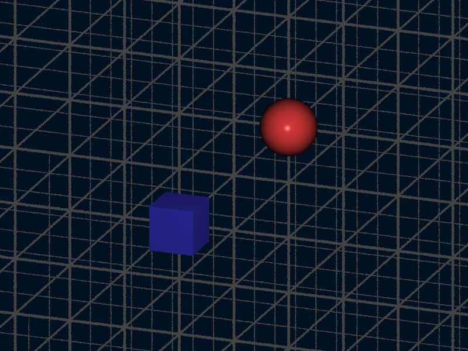
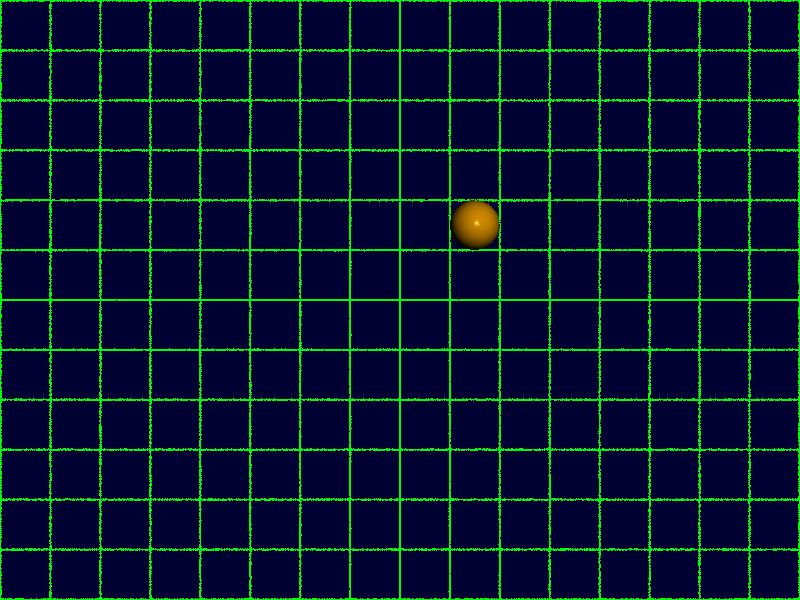
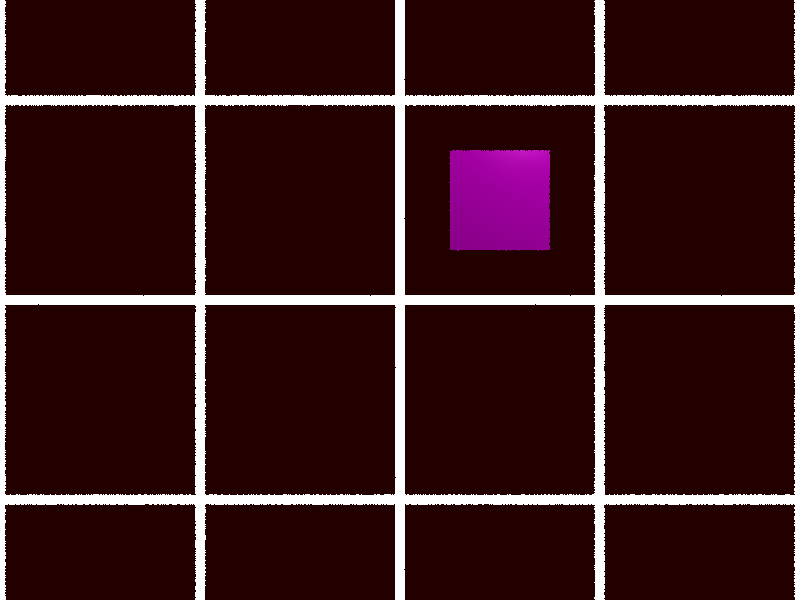

# rtrace Ray Tracer Documentation

This comprehensive guide covers all features and options available in the rtrace ray tracer, including scene format reference, command-line usage, and visual examples.

## Table of Contents

1. [Command Line Interface](#command-line-interface)
2. [Scene Format Overview](#scene-format-overview)
3. [Camera Settings](#camera-settings)
4. [Objects](#objects)
   - [Sphere](#sphere)
   - [Plane](#plane)
   - [Cube](#cube)  
   - [Mesh (STL)](#mesh-stl)
5. [Materials](#materials)
   - [Basic Material Properties](#basic-material-properties)
   - [Reflectivity](#reflectivity)
   - [Textures](#textures)
6. [Lighting](#lighting)
7. [Scene Settings](#scene-settings)
   - [Ambient Illumination](#ambient-illumination)
   - [Background Color](#background-color)
   - [Fog Effects](#fog-effects)
8. [Stochastic Subsampling](#stochastic-subsampling)
9. [Deterministic Rendering](#deterministic-rendering)
10. [Examples](#examples)

---

## Command Line Interface

The rtrace CLI tool renders scenes from JSON files to PNG images.

### Usage

```bash
./target/release/rtrace [OPTIONS] --input <INPUT> --output <OUTPUT>
```

### Options

| Option | Short | Description | Default |
|--------|-------|-------------|---------|
| `--input <INPUT>` | `-i` | Input JSON scene file (required) | - |
| `--output <OUTPUT>` | `-o` | Output PNG image file (required) | - |
| `--width <WIDTH>` | `-w` | Image width in pixels | 800 |
| `--height <HEIGHT>` | `-H` | Image height in pixels | 600 |
| `--max-depth <MAX_DEPTH>` | - | Maximum ray bounces for reflections | 10 |
| `--samples <SAMPLES>` | - | Number of samples per pixel | Auto (5 for quincunx) |
| `--anti-aliasing <MODE>` | - | Anti-aliasing mode: quincunx, stochastic, or no-jitter | quincunx |
| `--help` | `-h` | Print help information | - |
| `--version` | `-V` | Print version information | - |

### Example Commands

```bash
# Basic rendering (uses quincunx anti-aliasing by default)
./target/release/rtrace -i examples/simple_sphere.json -o output.png

# Custom resolution
./target/release/rtrace -i scene.json -o high_res.png -w 1920 -H 1080

# High reflection depth for mirror effects
./target/release/rtrace -i mirror_scene.json -o mirrors.png --max-depth 20

# Deterministic rendering (no anti-aliasing)
./target/release/rtrace -i scene.json -o deterministic.png --anti-aliasing no-jitter

# Stochastic anti-aliasing with 4 samples
./target/release/rtrace -i scene.json -o stochastic.png --anti-aliasing stochastic --samples 4

# High-quality quincunx anti-aliasing (default, 5 samples)
./target/release/rtrace -i scene.json -o smooth.png --anti-aliasing quincunx
```

---

## Scene Format Overview

Scenes are defined in JSON format following a specific schema. Every scene requires four main sections:

```json
{
  "camera": { /* Camera configuration */ },
  "objects": [ /* Array of objects in the scene */ ],
  "lights": [ /* Array of light sources */ ],
  "scene_settings": { /* Global scene settings */ }
}
```

---

## Camera Settings

rtrace supports both orthographic and perspective projection cameras.

### Orthographic Camera

```json
{
  "camera": {
    "kind": "ortho",
    "position": [0, 0, 10],
    "target": [0, 0, 0], 
    "up": [0, 1, 0],
    "width": 6,
    "height": 6
  }
}
```

| Property | Type | Description |
|----------|------|-------------|
| `kind` | string | Camera type, must be `"ortho"` |
| `position` | [x, y, z] | Camera position in 3D space |
| `target` | [x, y, z] | Point the camera looks at |
| `up` | [x, y, z] | Camera up vector (typically [0, 1, 0]) |
| `width` | number | Viewport width in world units |
| `height` | number | Viewport height in world units |
| `grid_pitch` | number (optional) | Distance between grid lines for background grid |
| `grid_color` | string (optional) | Hex color for grid lines (e.g., "#444444") |
| `grid_thickness` | number (optional) | Thickness of grid lines in world units |

### Orthographic Grid Background

Orthographic cameras support an optional grid background that renders world-coordinate grid lines when rays miss all objects. The grid appears on the world coordinate planes (XY, XZ, and YZ) centered at the origin.

```json
{
  "camera": {
    "kind": "ortho",
    "position": [3, 3, 8],
    "target": [0, 0, 0],
    "up": [0, 1, 0], 
    "width": 8,
    "height": 6,
    "grid_pitch": 1.0,
    "grid_color": "#444444",
    "grid_thickness": 0.05
  }
}
```

**Grid Properties:**
- `grid_pitch`: Distance between grid lines (e.g., 1.0 creates lines at x=0, x=1, x=2, etc.)
- `grid_color`: Color of the grid lines in hex format
- `grid_thickness`: Width of the grid lines in world units

All three grid properties must be specified for the grid to appear. Grid backgrounds only work with orthographic cameras.

**Example:** Orthographic scene with grid background



### Perspective Camera

```json
{
  "camera": {
    "kind": "perspective",
    "position": [0, 2, 5],
    "target": [0, 0, 0],
    "up": [0, 1, 0],
    "width": 8,
    "height": 6,
    "fov": 60
  }
}
```

| Property | Type | Description |
|----------|------|-------------|
| `kind` | string | Camera type, must be `"perspective"` |
| `position` | [x, y, z] | Camera position in 3D space |
| `target` | [x, y, z] | Point the camera looks at |
| `up` | [x, y, z] | Camera up vector (typically [0, 1, 0]) |
| `width` | number | Viewport width in world units |
| `height` | number | Viewport height in world units |
| `fov` | number | Field of view angle in degrees |

**Example:** Basic orthographic camera setup


---

## Objects

rtrace supports four types of geometric objects: spheres, planes, cubes, and triangle meshes from STL files.

### Sphere

Spheres are defined by a center point and radius.

```json
{
  "kind": "sphere",
  "center": [0, 0, 0],
  "radius": 1.5,
  "material": { /* material properties */ }
}
```

| Property | Type | Description |
|----------|------|-------------|
| `kind` | string | Must be `"sphere"` |
| `center` | [x, y, z] | Sphere center position |
| `radius` | number | Sphere radius (must be positive) |
| `material` | object | Material properties (see Materials section) |

**Example:** Simple red sphere


### Plane

Infinite planes defined by a point and normal vector.

```json
{
  "kind": "plane",
  "point": [0, -2, 0],
  "normal": [0, 1, 0],
  "material": { /* material properties */ }
}
```

| Property | Type | Description |
|----------|------|-------------|
| `kind` | string | Must be `"plane"` |
| `point` | [x, y, z] | Any point on the plane |
| `normal` | [x, y, z] | Plane normal vector |
| `material` | object | Material properties |

**Example:** Horizontal plane with grid texture


### Cube

Axis-aligned rectangular boxes defined by center and dimensions.

```json
{
  "kind": "cube",
  "center": [0, 0, 0],
  "size": [2, 2, 2],
  "material": { /* material properties */ }
}
```

| Property | Type | Description |
|----------|------|-------------|
| `kind` | string | Must be `"cube"` |
| `center` | [x, y, z] | Cube center position |
| `size` | [w, h, d] | Width, height, and depth dimensions |
| `material` | object | Material properties |

**Example:** Blue cube


### Mesh (STL)

Triangle meshes loaded from STL files (ASCII or binary format).

```json
{
  "kind": "mesh",
  "filename": "models/example.stl",
  "material": { /* material properties */ }
}
```

| Property | Type | Description |
|----------|------|-------------|
| `kind` | string | Must be `"mesh"` |
| `filename` | string | Path to STL file |
| `material` | object | Material properties |

**Example:** Complex mesh model


---

## Materials

Materials define how objects interact with light and their visual appearance.

### Basic Material Properties

```json
{
  "material": {
    "color": "#FF4444",
    "ambient": 0.1,
    "diffuse": 0.8,
    "specular": 0.4,
    "shininess": 32
  }
}
```

| Property | Type | Range | Description |
|----------|------|-------|-------------|
| `color` | string | - | Base color as hex string (e.g., "#FF0000") |
| `ambient` | number | 0.0-1.0 | Ambient light reflection coefficient |
| `diffuse` | number | 0.0-1.0 | Diffuse light reflection coefficient |
| `specular` | number | 0.0-1.0 | Specular light reflection coefficient |
| `shininess` | number | ≥1 | Phong exponent for specular highlights |

**Example:** Material property comparison


### Reflectivity

Optional mirror-like reflections for surfaces.

```json
{
  "material": {
    "color": "#CCCCCC",
    "ambient": 0.1,
    "diffuse": 0.3,
    "specular": 0.8,
    "shininess": 100,
    "reflectivity": 0.7
  }
}
```

| Property | Type | Range | Description |
|----------|------|-------|-------------|
| `reflectivity` | number | 0.0-1.0 | Reflection strength (0=no reflection, 1=perfect mirror) |

**Example:** Reflective spheres


### Textures

Currently supports grid patterns for planes.

```json
{
  "material": {
    "color": "#FFFFFF",
    "ambient": 0.2,
    "diffuse": 0.8,
    "specular": 0.1,
    "shininess": 10,
    "texture": {
      "type": "grid",
      "line_color": "#333333",
      "line_width": 0.1,
      "cell_size": 1.0
    }
  }
}
```

| Property | Type | Description |
|----------|------|-------------|
| `type` | string | Texture type, must be `"grid"` |
| `line_color` | string | Grid line color as hex string |
| `line_width` | number | Grid line thickness in world units |
| `cell_size` | number | Size of each grid cell in world units |

**Example:** Different grid patterns


---

## Lighting

rtrace supports both point lights and diffuse (area) lights for different lighting effects.

### Point Lights

Traditional point light sources with sharp shadows and fast rendering.

```json
{
  "lights": [
    {
      "position": [3, 3, 5],
      "color": "#FFFFFF", 
      "intensity": 1.0
    }
  ]
}
```

| Property | Type | Description |
|----------|------|-------------|
| `position` | [x, y, z] | Light position in 3D space |
| `color` | string | Light color as hex string |
| `intensity` | number | Light intensity multiplier (≥0) |

### Diffuse (Area) Lights

Area light sources that create soft shadows and realistic lighting by simulating light sources with physical size.

```json
{
  "lights": [
    {
      "position": [2, 4, 3],
      "color": "#FFFFFF",
      "intensity": 1.0,
      "diameter": 2.0
    }
  ]
}
```

| Property | Type | Description |
|----------|------|-------------|
| `position` | [x, y, z] | Light position in 3D space |
| `color` | string | Light color as hex string |
| `intensity` | number | Light intensity multiplier (≥0) |
| `diameter` | number (optional) | Light disk diameter. If omitted or null, behaves as point light |

#### Light Type Comparison

- **Point lights** (`diameter` omitted or null): Sharp shadows, fast rendering (1 shadow ray per pixel)
- **Diffuse lights** (`diameter > 0`): Soft shadows, slower rendering (16 shadow rays per pixel)

#### Visual Effects

Diffuse lights create several realistic lighting phenomena:
- **Soft shadows**: Shadow edges fade gradually from dark to light areas
- **Contact shadows**: Areas near object contact points have sharper shadows  
- **Penumbra effects**: Natural shadow falloff similar to real-world lighting
- **Area lighting**: Objects receive illumination from multiple directions

#### Performance Considerations

Diffuse lights require 16x more shadow ray calculations than point lights. Use sparingly for optimal performance, or consider fewer samples for preview renders.

**Example:** Multiple colored lights


**Example:** Diffuse light comparison showing soft vs. sharp shadows


---

## Scene Settings

Global settings that affect the entire scene.

### Ambient Illumination

Base lighting that affects all surfaces uniformly.

```json
{
  "scene_settings": {
    "ambient_illumination": {
      "color": "#FFFFFF",
      "intensity": 0.1
    }
  }
}
```

| Property | Type | Description |
|----------|------|-------------|
| `color` | string | Ambient light color as hex string |
| `intensity` | number | Ambient light intensity (≥0) |

### Background Color

Color displayed for rays that don't hit any objects.

```json
{
  "scene_settings": {
    "background_color": "#001122"
  }
}
```

**Example:** Different background colors

| Dark Blue Background | Warm Background |
|:-------------------:|:---------------:|
|  |  |

### Fog Effects

Atmospheric fog with linear falloff.

```json
{
  "scene_settings": {
    "fog": {
      "color": "#DDDDDD",
      "density": 0.1,
      "start": 2.0,
      "end": 10.0
    }
  }
}
```

| Property | Type | Description |
|----------|------|-------------|
| `color` | string | Fog color as hex string |
| `density` | number | Fog density factor (≥0) |
| `start` | number | Distance where fog begins |
| `end` | number | Distance where fog reaches maximum density |

**Example:** Fog density comparison

| Light Fog | Heavy Fog |
|:---------:|:---------:|
|  |  |

---

## Anti-Aliasing

rtrace supports three different anti-aliasing methods for controlling image quality and edge smoothness:

### Anti-Aliasing Methods

1. **Quincunx (default)**: Deterministic 5-sample pattern with center + 4 corners for high-quality anti-aliasing
2. **Stochastic**: Random jittered sampling with configurable sample counts
3. **No Jitter**: Deterministic center-pixel sampling with no anti-aliasing

### How Each Method Works

- **Quincunx**: Casts 5 rays per pixel in a fixed pattern: one at the center and four at the corners (±0.25 pixel offset). Provides consistent, high-quality anti-aliasing with deterministic results.
- **Stochastic**: Uses random jittering within pixel bounds. Single sample mode uses random offset, multi-sample mode uses radially symmetric patterns with random phase.
- **No Jitter**: Casts one ray per pixel at the exact center of each pixel - completely deterministic with no anti-aliasing
- **Color Averaging**: When using multiple samples, all samples for each pixel are averaged to produce the final color

### Usage Examples

```bash
# Quincunx anti-aliasing (default, deterministic)
./target/release/rtrace -i scene.json -o output.png --anti-aliasing quincunx

# No anti-aliasing (fastest, deterministic)
./target/release/rtrace -i scene.json -o no_aa.png --anti-aliasing no-jitter

# Stochastic anti-aliasing with 1 sample
./target/release/rtrace -i scene.json -o stochastic1.png --anti-aliasing stochastic --samples 1

# Stochastic anti-aliasing with 4 samples per pixel
./target/release/rtrace -i scene.json -o stochastic4.png --anti-aliasing stochastic --samples 4

# High quality stochastic rendering with 16 samples
./target/release/rtrace -i scene.json -o stochastic16.png --anti-aliasing stochastic --samples 16
```

### Performance Impact

Different anti-aliasing modes have different performance characteristics:
- **No Jitter**: Fastest, completely deterministic, may show aliasing (1x render time)
- **Quincunx** (default): High quality deterministic anti-aliasing (5x render time)
- **Stochastic (1 sample)**: Fast with basic randomized anti-aliasing (1x render time)  
- **Stochastic (4 samples)**: Good balance of quality and speed (4x render time)
- **Stochastic (16 samples)**: Highest quality, slowest (16x render time)

### Visual Comparison

The difference is most noticeable on edges and fine details. Here's the same scene rendered with three different approaches:

| No Anti-Aliasing | Quincunx (default) | Stochastic (4 samples) |
|:-----------------:|:------------------:|:----------------------:|
|  |  |  |

**Scene:** Complex geometry with grid textures and perspective camera demonstrates the effect of different anti-aliasing approaches on object edges and texture boundaries. Notice how:
- **No anti-aliasing** produces sharp, aliased edges but is fastest and completely reproducible
- **Quincunx** (default) provides high-quality deterministic anti-aliasing with smooth edges
- **Stochastic sampling** offers flexible quality control but with randomized results

### Anti-Aliasing Comparison

Here's a simpler comparison showing the fundamental difference between no anti-aliasing and anti-aliasing:

| No Anti-Aliasing | Quincunx Anti-Aliasing (default) |
|:----------------:|:--------------------------------:|
|  |  |

This comparison clearly shows:
- **Left (--anti-aliasing no-jitter)**: No anti-aliasing with visible aliasing on object edges but fastest rendering
- **Right (--anti-aliasing quincunx)**: Quincunx anti-aliasing produces smooth, high-quality edges with deterministic results

---

## Examples

### Complete Scene Example

Here's a comprehensive scene demonstrating multiple features:

```json
{
  "camera": {
    "kind": "ortho",
    "position": [5, 5, 8],
    "target": [0, 0, 0],
    "up": [0, 1, 0],
    "width": 8,
    "height": 6
  },
  "objects": [
    {
      "kind": "sphere",
      "center": [-2, 1, 0],
      "radius": 1.0,
      "material": {
        "color": "#FF4444",
        "ambient": 0.1,
        "diffuse": 0.7,
        "specular": 0.3,
        "shininess": 32
      }
    },
    {
      "kind": "cube", 
      "center": [2, 0, 0],
      "size": [1.5, 1.5, 1.5],
      "material": {
        "color": "#4444FF",
        "ambient": 0.1,
        "diffuse": 0.8,
        "specular": 0.5,
        "shininess": 64,
        "reflectivity": 0.3
      }
    },
    {
      "kind": "plane",
      "point": [0, -2, 0],
      "normal": [0, 1, 0],
      "material": {
        "color": "#FFFFFF",
        "ambient": 0.2,
        "diffuse": 0.8,
        "specular": 0.1,
        "shininess": 10,
        "texture": {
          "type": "grid",
          "line_color": "#333333",
          "line_width": 0.05,
          "cell_size": 1.0
        }
      }
    }
  ],
  "lights": [
    {
      "position": [3, 4, 5],
      "color": "#FFFFFF",
      "intensity": 1.0
    },
    {
      "position": [-3, 2, 3],
      "color": "#FFAAAA", 
      "intensity": 0.6
    }
  ],
  "scene_settings": {
    "ambient_illumination": {
      "color": "#FFFFFF",
      "intensity": 0.15
    },
    "background_color": "#223344",
    "fog": {
      "color": "#AACCDD",
      "density": 0.05,
      "start": 3.0,
      "end": 12.0
    }
  }
}
```

**Result:** Complete scene with multiple features


### Orthographic Grid Background Examples

The following examples demonstrate the orthographic camera grid background feature:

#### Basic Grid Background

```json
{
  "camera": {
    "kind": "ortho",
    "position": [3, 3, 8],
    "target": [0, 0, 0],
    "up": [0, 1, 0],
    "width": 8,
    "height": 6,
    "grid_pitch": 1.0,
    "grid_color": "#444444",
    "grid_thickness": 0.05
  },
  "objects": [
    {
      "kind": "sphere",
      "center": [1, 1, 0],
      "radius": 0.5,
      "material": {
        "color": "#FF4444",
        "ambient": 0.1,
        "diffuse": 0.8,
        "specular": 0.4,
        "shininess": 64
      }
    },
    {
      "kind": "cube", 
      "center": [-1, -1, 0],
      "size": [0.8, 0.8, 0.8],
      "material": {
        "color": "#4444FF",
        "ambient": 0.1,
        "diffuse": 0.8,
        "specular": 0.4,
        "shininess": 64
      }
    }
  ],
  "lights": [
    {
      "position": [3, 3, 5],
      "color": "#FFFFFF",
      "intensity": 1.0
    }
  ],
  "scene_settings": {
    "ambient_illumination": {
      "color": "#FFFFFF",
      "intensity": 0.1
    },
    "background_color": "#001122"
  }
}
```


#### Fine Grid with Different Parameters

```json
{
  "camera": {
    "kind": "ortho",
    "position": [0, 0, 8],
    "target": [0, 0, 0],
    "up": [0, 1, 0],
    "width": 6,
    "height": 6,
    "grid_pitch": 0.5,
    "grid_color": "#00FF00", 
    "grid_thickness": 0.02
  }
  // ... rest of scene
}
```



#### Side View with Grid

```json
{
  "camera": {
    "kind": "ortho",
    "position": [5, 0, 0],
    "target": [0, 0, 0],
    "up": [0, 0, 1],
    "width": 8,
    "height": 6,
    "grid_pitch": 2.0,
    "grid_color": "#FFFFFF",
    "grid_thickness": 0.1
  }
  // ... rest of scene  
}
```



---

## Deterministic Rendering

The ray tracer ensures **deterministic, reproducible results** by using deterministic randomness for all stochastic operations. This means that the same input scene will always produce byte-for-byte identical output images, regardless of hardware or thread count.

### How It Works

All randomness in the ray tracer is controlled by deterministic seeding:

- **Anti-aliasing sampling**: Each pixel gets a unique deterministic seed based on coordinates
- **Area light sampling**: Hit points generate consistent random sequences for soft shadows
- **Thread-safe**: Results are independent of thread scheduling or execution order

### Usage

The ray tracer produces deterministic results by default:

```bash
# Always produces identical results
./rtrace --input scene.json --output render1.png
./rtrace --input scene.json --output render2.png
# render1.png and render2.png are byte-for-byte identical
```

### Benefits

- **Reproducible renders**: Perfect for version control, debugging, and collaboration
- **Consistent results**: Same scene always produces same output across systems
- **Reliable output**: Eliminates randomness-related inconsistencies
- **Thread-independent**: Results don't depend on CPU core count or scheduling

### Anti-aliasing Modes

All anti-aliasing modes are deterministic:

- **Quincunx** (default): 5 samples per pixel (center + 4 corners), shared between adjacent pixels
- **Stochastic**: Random jittered sampling within pixel bounds, configurable sample count
- **No-jitter**: Single center sample per pixel, fastest rendering

```bash
# Deterministic stochastic sampling with 16 samples per pixel
./rtrace --input scene.json --output high_quality.png --anti-aliasing stochastic --samples 16

# Deterministic quincunx (default)
./rtrace --input scene.json --output default.png

# No randomness needed
./rtrace --input scene.json --output clean.png --anti-aliasing no-jitter
```

---

## Building and Rendering Documentation Images

To generate all documentation images, use the hereby tasks:

```bash
# Render all documentation examples
npm run doc:render

# Build CLI first if needed
npm run build:cli
```

The generated images follow the naming convention: `doc/images/feature-description.png`