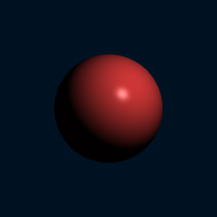
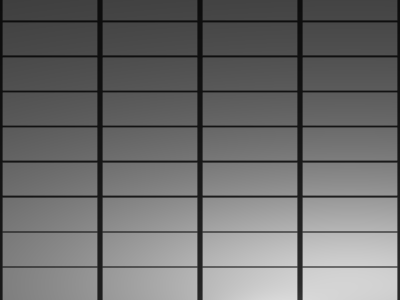
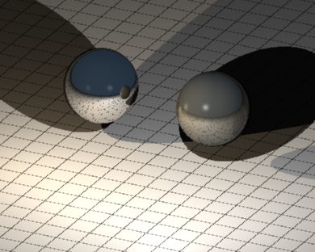

# rtrace Ray Tracer Documentation

This comprehensive guide covers all features and options available in the rtrace ray tracer, including scene format reference, command-line usage, and visual examples.

## Table of Contents

1. [Command Line Interface](#command-line-interface)
2. [Scene Format Overview](#scene-format-overview)
3. [Camera Settings](#camera-settings)
4. [Objects](#objects)
   - [Sphere](#sphere)
   - [Plane](#plane)
   - [Cube](#cube)  
   - [Mesh (STL)](#mesh-stl)
5. [Materials](#materials)
   - [Basic Material Properties](#basic-material-properties)
   - [Reflectivity](#reflectivity)
   - [Textures](#textures)
6. [Lighting](#lighting)
7. [Scene Settings](#scene-settings)
   - [Ambient Illumination](#ambient-illumination)
   - [Background Color](#background-color)
   - [Fog Effects](#fog-effects)
8. [Stochastic Subsampling](#stochastic-subsampling)
9. [Examples](#examples)

---

## Command Line Interface

The rtrace CLI tool renders scenes from JSON files to PNG images.

### Usage

```bash
./target/release/rtrace [OPTIONS] --input <INPUT> --output <OUTPUT>
```

### Options

| Option | Short | Description | Default |
|--------|-------|-------------|---------|
| `--input <INPUT>` | `-i` | Input JSON scene file (required) | - |
| `--output <OUTPUT>` | `-o` | Output PNG image file (required) | - |
| `--width <WIDTH>` | `-w` | Image width in pixels | 800 |
| `--height <HEIGHT>` | `-H` | Image height in pixels | 600 |
| `--max-depth <MAX_DEPTH>` | - | Maximum ray bounces for reflections | 10 |
| `--samples <SAMPLES>` | - | Number of samples per pixel for anti-aliasing | 1 |
| `--no-jitter` | - | Disable stochastic jittering (use center-pixel sampling) | false |
| `--help` | `-h` | Print help information | - |
| `--version` | `-V` | Print version information | - |

### Example Commands

```bash
# Basic rendering
./target/release/rtrace -i examples/simple_sphere.json -o output.png

# Custom resolution
./target/release/rtrace -i scene.json -o high_res.png -w 1920 -H 1080

# High reflection depth for mirror effects
./target/release/rtrace -i mirror_scene.json -o mirrors.png --max-depth 20

# Deterministic rendering (no stochastic sampling)
./target/release/rtrace -i scene.json -o deterministic.png --samples 1 --no-jitter

# Anti-aliasing with stochastic subsampling  
./target/release/rtrace -i scene.json -o smooth.png --samples 4
```

---

## Scene Format Overview

Scenes are defined in JSON format following a specific schema. Every scene requires four main sections:

```json
{
  "camera": { /* Camera configuration */ },
  "objects": [ /* Array of objects in the scene */ ],
  "lights": [ /* Array of light sources */ ],
  "scene_settings": { /* Global scene settings */ }
}
```

---

## Camera Settings

rtrace supports both orthographic and perspective projection cameras.

### Orthographic Camera

```json
{
  "camera": {
    "kind": "ortho",
    "position": [0, 0, 10],
    "target": [0, 0, 0], 
    "up": [0, 1, 0],
    "width": 6,
    "height": 6
  }
}
```

| Property | Type | Description |
|----------|------|-------------|
| `kind` | string | Camera type, must be `"ortho"` |
| `position` | [x, y, z] | Camera position in 3D space |
| `target` | [x, y, z] | Point the camera looks at |
| `up` | [x, y, z] | Camera up vector (typically [0, 1, 0]) |
| `width` | number | Viewport width in world units |
| `height` | number | Viewport height in world units |

### Perspective Camera

```json
{
  "camera": {
    "kind": "perspective",
    "position": [0, 2, 5],
    "target": [0, 0, 0],
    "up": [0, 1, 0],
    "width": 8,
    "height": 6,
    "fov": 60
  }
}
```

| Property | Type | Description |
|----------|------|-------------|
| `kind` | string | Camera type, must be `"perspective"` |
| `position` | [x, y, z] | Camera position in 3D space |
| `target` | [x, y, z] | Point the camera looks at |
| `up` | [x, y, z] | Camera up vector (typically [0, 1, 0]) |
| `width` | number | Viewport width in world units |
| `height` | number | Viewport height in world units |
| `fov` | number | Field of view angle in degrees |

**Example:** Basic orthographic camera setup


---

## Objects

rtrace supports four types of geometric objects: spheres, planes, cubes, and triangle meshes from STL files.

### Sphere

Spheres are defined by a center point and radius.

```json
{
  "kind": "sphere",
  "center": [0, 0, 0],
  "radius": 1.5,
  "material": { /* material properties */ }
}
```

| Property | Type | Description |
|----------|------|-------------|
| `kind` | string | Must be `"sphere"` |
| `center` | [x, y, z] | Sphere center position |
| `radius` | number | Sphere radius (must be positive) |
| `material` | object | Material properties (see Materials section) |

**Example:** Simple red sphere



### Plane

Infinite planes defined by a point and normal vector.

```json
{
  "kind": "plane",
  "point": [0, -2, 0],
  "normal": [0, 1, 0],
  "material": { /* material properties */ }
}
```

| Property | Type | Description |
|----------|------|-------------|
| `kind` | string | Must be `"plane"` |
| `point` | [x, y, z] | Any point on the plane |
| `normal` | [x, y, z] | Plane normal vector |
| `material` | object | Material properties |

**Example:** Horizontal plane with grid texture



### Cube

Axis-aligned rectangular boxes defined by center and dimensions.

```json
{
  "kind": "cube",
  "center": [0, 0, 0],
  "size": [2, 2, 2],
  "material": { /* material properties */ }
}
```

| Property | Type | Description |
|----------|------|-------------|
| `kind` | string | Must be `"cube"` |
| `center` | [x, y, z] | Cube center position |
| `size` | [w, h, d] | Width, height, and depth dimensions |
| `material` | object | Material properties |

**Example:** Blue cube


### Mesh (STL)

Triangle meshes loaded from STL files (ASCII or binary format).

```json
{
  "kind": "mesh",
  "filename": "models/example.stl",
  "material": { /* material properties */ }
}
```

| Property | Type | Description |
|----------|------|-------------|
| `kind` | string | Must be `"mesh"` |
| `filename` | string | Path to STL file |
| `material` | object | Material properties |

**Example:** Complex mesh model


---

## Materials

Materials define how objects interact with light and their visual appearance.

### Basic Material Properties

```json
{
  "material": {
    "color": "#FF4444",
    "ambient": 0.1,
    "diffuse": 0.8,
    "specular": 0.4,
    "shininess": 32
  }
}
```

| Property | Type | Range | Description |
|----------|------|-------|-------------|
| `color` | string | - | Base color as hex string (e.g., "#FF0000") |
| `ambient` | number | 0.0-1.0 | Ambient light reflection coefficient |
| `diffuse` | number | 0.0-1.0 | Diffuse light reflection coefficient |
| `specular` | number | 0.0-1.0 | Specular light reflection coefficient |
| `shininess` | number | ≥1 | Phong exponent for specular highlights |

**Example:** Material property comparison


### Reflectivity

Optional mirror-like reflections for surfaces.

```json
{
  "material": {
    "color": "#CCCCCC",
    "ambient": 0.1,
    "diffuse": 0.3,
    "specular": 0.8,
    "shininess": 100,
    "reflectivity": 0.7
  }
}
```

| Property | Type | Range | Description |
|----------|------|-------|-------------|
| `reflectivity` | number | 0.0-1.0 | Reflection strength (0=no reflection, 1=perfect mirror) |

**Example:** Reflective spheres



### Textures

Currently supports grid patterns for planes.

```json
{
  "material": {
    "color": "#FFFFFF",
    "ambient": 0.2,
    "diffuse": 0.8,
    "specular": 0.1,
    "shininess": 10,
    "texture": {
      "type": "grid",
      "line_color": "#333333",
      "line_width": 0.1,
      "cell_size": 1.0
    }
  }
}
```

| Property | Type | Description |
|----------|------|-------------|
| `type` | string | Texture type, must be `"grid"` |
| `line_color` | string | Grid line color as hex string |
| `line_width` | number | Grid line thickness in world units |
| `cell_size` | number | Size of each grid cell in world units |

**Example:** Different grid patterns


---

## Lighting

Point light sources with position, color, and intensity.

```json
{
  "lights": [
    {
      "position": [3, 3, 5],
      "color": "#FFFFFF", 
      "intensity": 1.0
    }
  ]
}
```

| Property | Type | Description |
|----------|------|-------------|
| `position` | [x, y, z] | Light position in 3D space |
| `color` | string | Light color as hex string |
| `intensity` | number | Light intensity multiplier (≥0) |

**Example:** Multiple colored lights


---

## Scene Settings

Global settings that affect the entire scene.

### Ambient Illumination

Base lighting that affects all surfaces uniformly.

```json
{
  "scene_settings": {
    "ambient_illumination": {
      "color": "#FFFFFF",
      "intensity": 0.1
    }
  }
}
```

| Property | Type | Description |
|----------|------|-------------|
| `color` | string | Ambient light color as hex string |
| `intensity` | number | Ambient light intensity (≥0) |

### Background Color

Color displayed for rays that don't hit any objects.

```json
{
  "scene_settings": {
    "background_color": "#001122"
  }
}
```

**Example:** Different background colors

| Dark Blue Background | Warm Background |
|:-------------------:|:---------------:|
|  |  |

### Fog Effects

Atmospheric fog with linear falloff.

```json
{
  "scene_settings": {
    "fog": {
      "color": "#DDDDDD",
      "density": 0.1,
      "start": 2.0,
      "end": 10.0
    }
  }
}
```

| Property | Type | Description |
|----------|------|-------------|
| `color` | string | Fog color as hex string |
| `density` | number | Fog density factor (≥0) |
| `start` | number | Distance where fog begins |
| `end` | number | Distance where fog reaches maximum density |

**Example:** Fog density comparison

| Light Fog | Heavy Fog |
|:---------:|:---------:|
|  |  |

---

## Stochastic Subsampling

rtrace supports three different sampling approaches for controlling image quality and anti-aliasing:

### Sampling Methods

1. **No Jittering (--no-jitter)**: Deterministic center-pixel sampling with no randomization
2. **Stochastic Sampling (--samples 1)**: Single sample per pixel with random jittering for basic anti-aliasing  
3. **Multi-Sample Stochastic (--samples N)**: Multiple samples per pixel with stochastic patterns for high-quality anti-aliasing

### How Each Method Works

- **No Jittering**: Casts one ray per pixel at the exact center of each pixel - completely deterministic
- **Single Sample Stochastic**: Casts one ray per pixel with random jitter within pixel bounds
- **Multi-Sample Stochastic**: Casts N rays per pixel in a radially symmetric pattern with random phase
- **Color Averaging**: When using multiple samples, all samples for each pixel are averaged to produce the final color

### Usage Examples

```bash
# No jittering: deterministic center-pixel sampling
./target/release/rtrace -i scene.json -o output.png --samples 1 --no-jitter

# Single sample with stochastic jittering (default)
./target/release/rtrace -i scene.json -o output.png --samples 1

# Anti-aliasing with 4 samples per pixel
./target/release/rtrace -i scene.json -o smooth.png --samples 4

# High quality rendering with 16 samples
./target/release/rtrace -i scene.json -o ultra_smooth.png --samples 16
```

### Performance Impact

Higher sample counts improve quality but increase render time linearly:
- `--no-jitter --samples 1`: Fastest, completely deterministic, may show aliasing
- `--samples 1`: Fast, good for previews with basic anti-aliasing
- `--samples 4`: Good balance of quality and speed
- `--samples 16`: High quality, 16x slower render time

### Visual Comparison

The difference is most noticeable on edges and fine details. Here's the same scene rendered with three different approaches:

| No Jittering (deterministic) | Stochastic (1 sample) | Stochastic (4 samples) |
|:----------------------------:|:---------------------:|:----------------------:|
|  |  |  |

**Scene:** Complex geometry with grid textures and perspective camera demonstrates the effect of different sampling approaches on object edges and texture boundaries. Notice how:
- **No jittering** produces sharp, aliased edges but is completely reproducible
- **1-sample jittering** reduces aliasing while maintaining fast render times
- **4-sample jittering** provides smooth edges with minimal visual artifacts

### Anti-Aliasing Comparison

Here's a simpler comparison showing the fundamental difference between deterministic and stochastic sampling:

| No Sampling & No Jitter | Stochastic Anti-Aliasing |
|:------------------------:|:------------------------:|
|  |  |

This comparison clearly shows:
- **Left (--samples 1 --no-jitter)**: Completely deterministic rendering with visible aliasing on object edges
- **Right (--samples 4)**: Stochastic anti-aliasing produces smooth, high-quality edges

---

## Examples

### Complete Scene Example

Here's a comprehensive scene demonstrating multiple features:

```json
{
  "camera": {
    "kind": "ortho",
    "position": [5, 5, 8],
    "target": [0, 0, 0],
    "up": [0, 1, 0],
    "width": 8,
    "height": 6
  },
  "objects": [
    {
      "kind": "sphere",
      "center": [-2, 1, 0],
      "radius": 1.0,
      "material": {
        "color": "#FF4444",
        "ambient": 0.1,
        "diffuse": 0.7,
        "specular": 0.3,
        "shininess": 32
      }
    },
    {
      "kind": "cube", 
      "center": [2, 0, 0],
      "size": [1.5, 1.5, 1.5],
      "material": {
        "color": "#4444FF",
        "ambient": 0.1,
        "diffuse": 0.8,
        "specular": 0.5,
        "shininess": 64,
        "reflectivity": 0.3
      }
    },
    {
      "kind": "plane",
      "point": [0, -2, 0],
      "normal": [0, 1, 0],
      "material": {
        "color": "#FFFFFF",
        "ambient": 0.2,
        "diffuse": 0.8,
        "specular": 0.1,
        "shininess": 10,
        "texture": {
          "type": "grid",
          "line_color": "#333333",
          "line_width": 0.05,
          "cell_size": 1.0
        }
      }
    }
  ],
  "lights": [
    {
      "position": [3, 4, 5],
      "color": "#FFFFFF",
      "intensity": 1.0
    },
    {
      "position": [-3, 2, 3],
      "color": "#FFAAAA", 
      "intensity": 0.6
    }
  ],
  "scene_settings": {
    "ambient_illumination": {
      "color": "#FFFFFF",
      "intensity": 0.15
    },
    "background_color": "#223344",
    "fog": {
      "color": "#AACCDD",
      "density": 0.05,
      "start": 3.0,
      "end": 12.0
    }
  }
}
```

**Result:** Complete scene with multiple features


---

## Building and Rendering Documentation Images

To generate all documentation images, use the hereby tasks:

```bash
# Render all documentation examples
npm run doc:render

# Build CLI first if needed
npm run build:cli
```

The generated images follow the naming convention: `doc/images/feature-description.png`